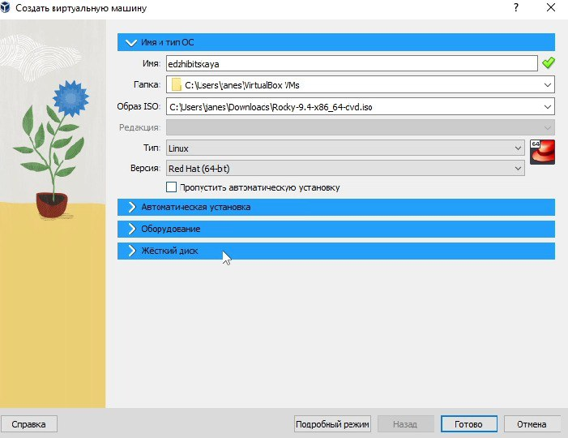
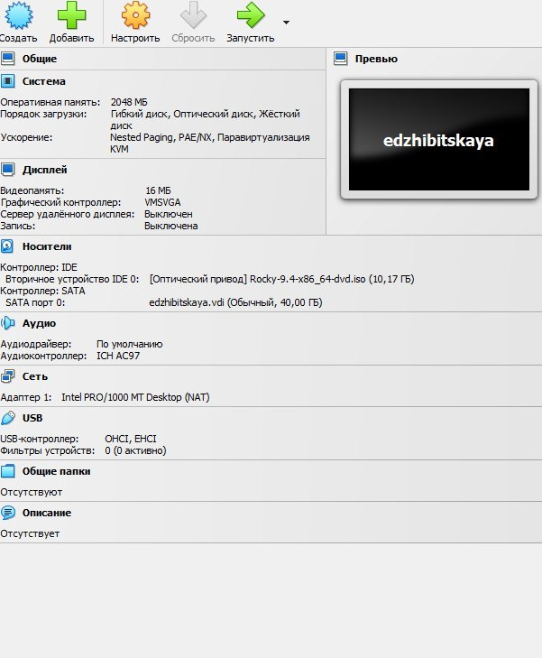
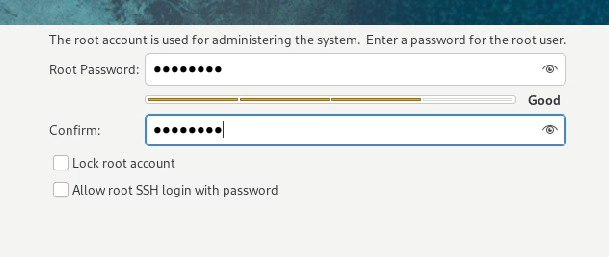
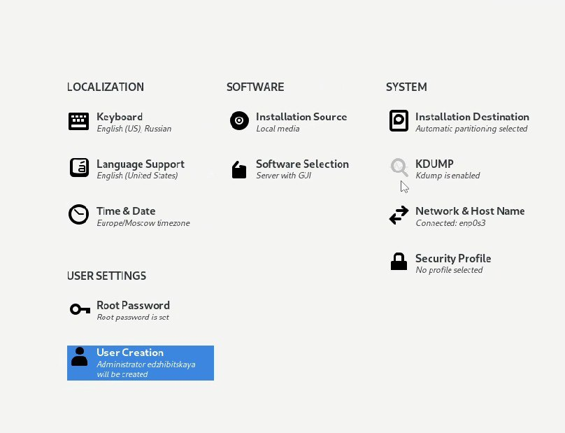
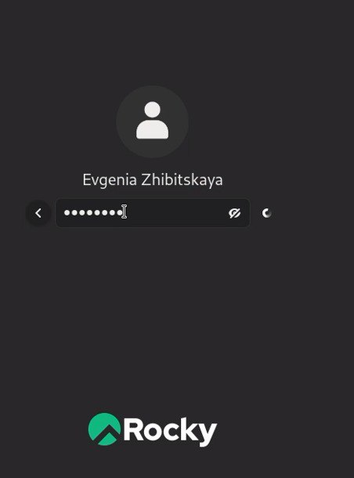
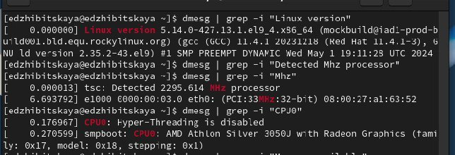
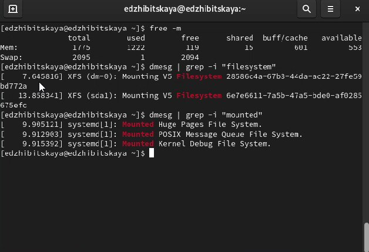
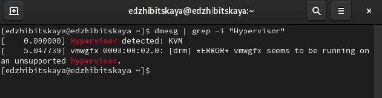

---
## Front matter
lang: ru-RU
title: Лабораторная №1
subtitle: Основы инофрмационной безопасности
author:
  - Жибицкая Е.Д.
institute:
  - Российский университет дружбы народов, Москва, Россия

## i18n babel
babel-lang: russian
babel-otherlangs: english

## Formatting pdf
toc: false
toc-title: Содержание
slide_level: 2
aspectratio: 169
section-titles: true
theme: metropolis
header-includes:
 - \metroset{progressbar=frametitle,sectionpage=progressbar,numbering=fraction}
---

# Цель

## Цель работы

- Установка и настройка операционной системы Rocky на виртуальной машине, подготовка ее к дальнейшей работе

# Ход работы 

## Создание машины

:::::::::::::: {.columns align=center}
::: {.column width="50%"}

:::
::: {.column width="40%"}

:::
::::::::::::::

## Установка

:::::::::::::: {.columns align=center}
::: {.column width="50%"}

:::
::: {.column width="50%"}

:::
::::::::::::::

## Вход в систему

:::::::::::::: {.columns align=center}
::: {.column width="40%"}

:::
::::::::::::::

## Домашнее задание

:::::::::::::: {.columns align=center}
::: {.column width="50%"}

:::
::: {.column width="50%"}

:::
::::::::::::::

## Домашнее задание

:::::::::::::: {.columns align=center}
::: {.column width="50%"}

:::
::::::::::::::

# Выводы

## Вывод

- В ходе работы была установлена и настроена ОС Rocky, приобретены навыки по данному типу работы.

