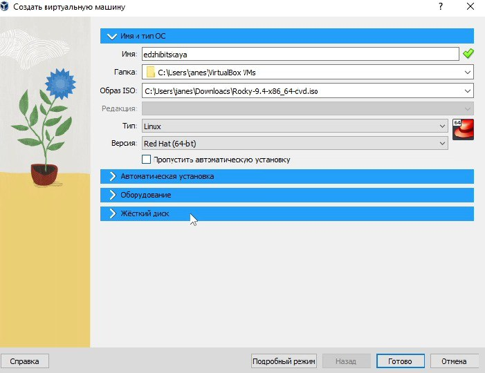
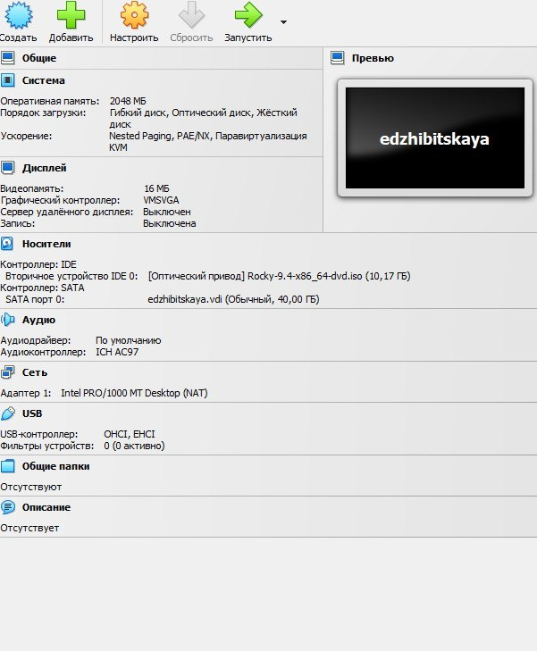
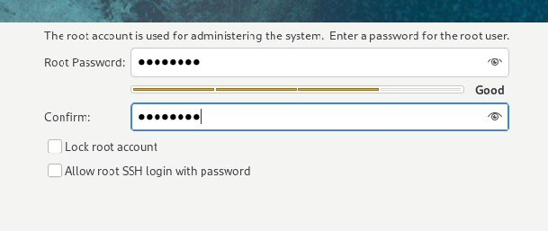
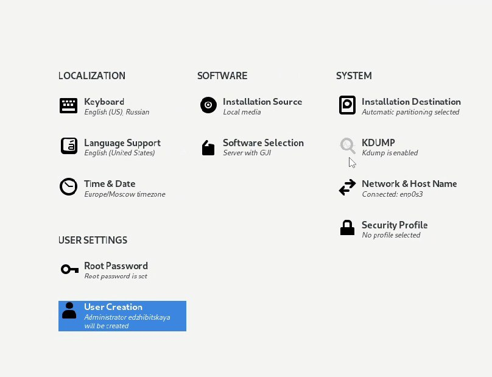
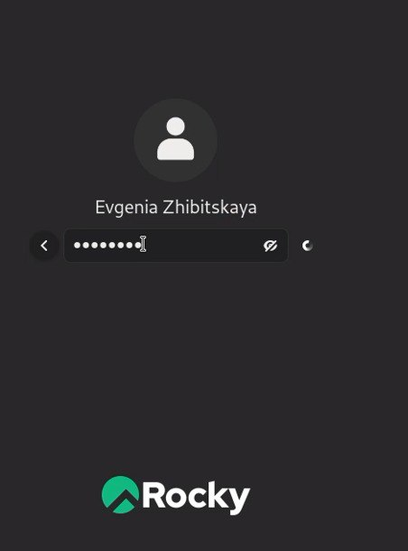
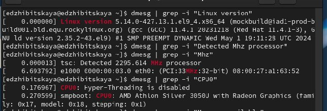
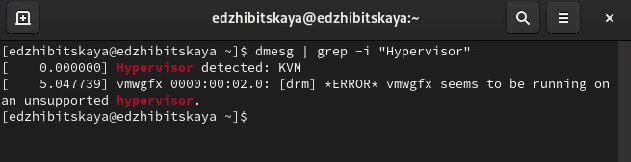
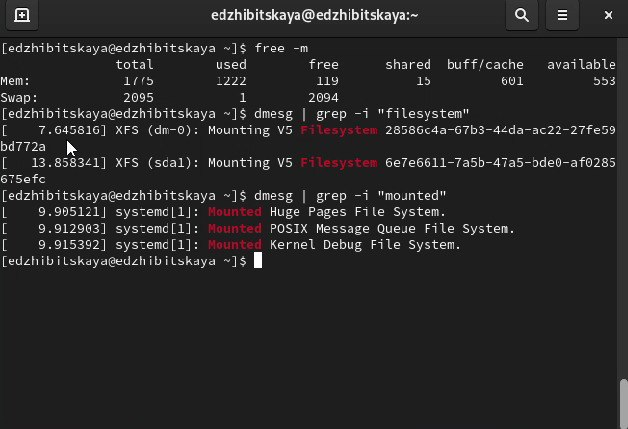

---
## Front matter
title: "Лабораторная работа №1"
subtitle: "Дисциплина: Основы информационной безопасности"
author: "Жибицкая Евгения Дмитриевна"

## Generic otions
lang: ru-RU
toc-title: "Содержание"

## Bibliography
bibliography: bib/cite.bib
csl: pandoc/csl/gost-r-7-0-5-2008-numeric.csl

## Pdf output format
toc: true # Table of contents
toc-depth: 2
lof: true # List of figures
lot: true # List of tables
fontsize: 12pt
linestretch: 1.5
papersize: a4
documentclass: scrreprt
## I18n polyglossia
polyglossia-lang:
  name: russian
  options:
	- spelling=modern
	- babelshorthands=true
polyglossia-otherlangs:
  name: english
## I18n babel
babel-lang: russian
babel-otherlangs: english
## Fonts
mainfont: IBM Plex Serif
romanfont: IBM Plex Serif
sansfont: IBM Plex Sans
monofont: IBM Plex Mono
mathfont: STIX Two Math
mainfontoptions: Ligatures=Common,Ligatures=TeX,Scale=0.94
romanfontoptions: Ligatures=Common,Ligatures=TeX,Scale=0.94
sansfontoptions: Ligatures=Common,Ligatures=TeX,Scale=MatchLowercase,Scale=0.94
monofontoptions: Scale=MatchLowercase,Scale=0.94,FakeStretch=0.9
mathfontoptions:
## Biblatex
biblatex: true
biblio-style: "gost-numeric"
biblatexoptions:
  - parentracker=true
  - backend=biber
  - hyperref=auto
  - language=auto
  - autolang=other*
  - citestyle=gost-numeric
## Pandoc-crossref LaTeX customization
figureTitle: "Рис."
tableTitle: "Таблица"
listingTitle: "Листинг"
lofTitle: "Список иллюстраций"
lotTitle: "Список таблиц"
lolTitle: "Листинги"
## Misc options
indent: true
header-includes:
  - \usepackage{indentfirst}
  - \usepackage{float} # keep figures where there are in the text
  - \floatplacement{figure}{H} # keep figures where there are in the text
---

# Цель работы

Установка и настройка операционной системы Rocky на виртуальной машине, подготовка ее к дальнейшей работе.

# Выполнение лабораторной работы

В VirtualBox придумываем название, указываем тип, версию и подключаем образ диска (рис. [-@fig:001]).

{#fig:001 width=70%}

Указываем все необходимые параметры: оперативную память, контроллеры привод и так далее, проверяем(рис. [-@fig:002]).

{#fig:002 width=70%}

Переходим к установке. Выбираем язык, указываем пароль и имя пользователя, настраиваем часовой поезд (рис. [-@fig:003] и [-@fig:004] ).

{#fig:003 width=70%}

{#fig:004 width=70%}

Перезапускаем, ждем, когда все пакеты загрузятся и входим в систему - установка завершена![-@fig:005] 

{#fig:005 width=70%}

Далее выполняем домашнее задание и получаем информацию о системе командой dmesg([-@fig:006], [-@fig:007] и [-@fig:008])

{#fig:006 width=70%}

{#fig:007 width=70%}

{#fig:008 width=70%}

# Ответы на контрольные вопросы 

1. Какую информацию содержит учётная запись пользователя?

Учётная запись пользователя в операционной системе обычно содержит следующую информацию:
- Логин 
- Пароль
- UID (идентификатор пользователя)
- GID (идентификатор группы)
- Полное имя
- Адрес электронной почты
- Дата создания учётной записи
- Последний вход в систему
- Права доступа
- Домашний каталог
- Параметры окружения

2. Укажите команды терминала и приведите примеры:
- Для получения справки по команде:
  - `man <команда>` (например, `man ls` для просмотра справки по команде `ls`)
  - `--help` (например, `ls --help`)

- Для перемещения по файловой системе:
  - `cd <путь>` (например, `cd /home/user`)

- Для просмотра содержимого каталога:
  - `ls` (например, `ls /home/user` для просмотра содержимого каталога пользователя)

- Для определения объёма каталога:
  - `du -sh <каталог>` (например, `du -sh /home/user`)

- Для создания / удаления каталогов / файлов:
  - Создание каталога: `mkdir <имя>` (например, `mkdir my_folder`)
  - Удаление каталога: `rmdir <имя>` (например, `rmdir my_folder`)
  - Создание файла: `touch <имя_файла>` (например, `touch myfile.txt`)
  - Удаление файла: `rm <имя_файла>` (например, `rm myfile.txt`)

- Для задания определённых прав на файл / каталог:
  - `chmod <права> <файл>` (например, `chmod 755 myfile.txt`)

- Для просмотра истории команд:
  - `history` (это выводит список ранее введённых команд)

3. Что такое файловая система? Приведите примеры с краткой характеристикой.

Файловая система — это способ организации и хранения данных на накопителе, который обеспечивает доступ к файлам и каталогам. 

Примеры файловых систем:
- FAT32: Широко используемая в USB-накопителях, поддерживает файлы размером до 4 ГБ и объем тома до 2 ТБ.
- ext4: Используется в большинстве дистрибутивов Linux, поддерживает большие объемы и файлы, обеспечивает отличную производительность и надежность.
- HFS+: Используется в операционных системах macOS, поддерживает метаданные файлов и возможности восстановления.

4. Как посмотреть, какие файловые системы подмонтированы в ОС?

Для просмотра текущих смонтированных файловых систем можно использовать команду:
- `df -h`
- Или `mount` — эта команда покажет список всех смонтированных файловых систем и их параметры.

5. Как удалить зависший процесс?

Для удаления зависшего процесса можно воспользоваться следующими командами:
1. Найти PID (идентификатор процесса) с помощью команды:
   - `ps aux | grep <имя_процесса>` (например, `ps aux | grep firefox`)
   
2. Убить процесс по его PID, используя команду:
   - `kill <PID>` (например, `kill 1234`)
   
3. Если процесс не завершился, можно использовать принудительное завершение:
   - `kill -9 <PID>` (например, `kill -9 1234`)

# Выводы

В ходе работы была установлена и настроена ОС Rocky, приобретены навыки по данному типу работы.

# Список литературы{.unnumbered}

::: {#refs}
::: [ТУИС](https://esystem.rudn.ru/pluginfile.php/2580975/mod_folder/content/0/001-lab_virtualbox.pdf)
