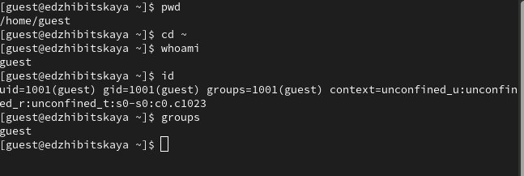
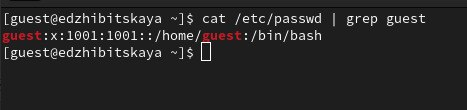
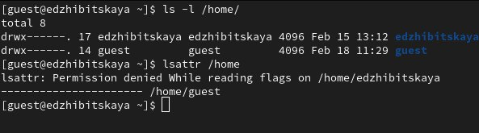
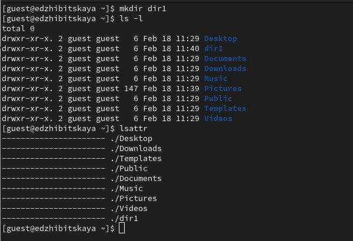
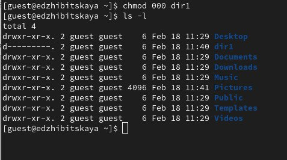
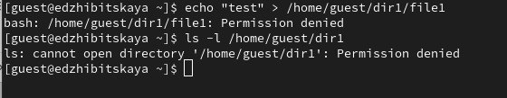
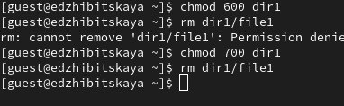
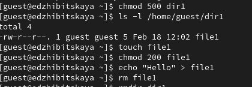

---
## Front matter
lang: ru-RU
title: Лабораторная №2
subtitle: Основы инофрмационной безопасности
author:
  - Жибицкая Е.Д.
institute:
  - Российский университет дружбы народов, Москва, Россия

## i18n babel
babel-lang: russian
babel-otherlangs: english

## Formatting pdf
toc: false
toc-title: Содержание
slide_level: 2
aspectratio: 169
section-titles: true
theme: metropolis
header-includes:
 - \metroset{progressbar=frametitle,sectionpage=progressbar,numbering=fraction}
---

# Цель

## Цель работы

- Получение навыков работы с атрибутами файлов через консоль, закрепление теоретических основ дискреционного разграничения доступа в современных системах с открытым кодом на базе ОС Linux

# Ход работы 

## Создание пользователя

:::::::::::::: {.columns align=center}
::: {.column width="50%"}

:::
::: {.column width="40%"}

Получим права администратора и создадим нового пользователя - guest. Зададим ему пароль

:::
::::::::::::::

## Учетная запись 

:::::::::::::: {.columns align=center}
::: {.column width="50%"}

:::
::: {.column width="50%"}

:::
::::::::::::::

## Права

:::::::::::::: {.columns align=center}
::: {.column width="50%"}

:::
::: {.column width="50%"}

Определяем существующие директории вместе с правами и проверяем, какие расширенные атрибуты установлены на поддиректориях, находящихся в директории /home

:::
::::::::::::::

## dir1

:::::::::::::: {.columns align=center}
::: {.column width="50%"}

:::
::: {.column width="50%"}

:::
::::::::::::::

## Попытка работы с фалом и директорией

:::::::::::::: {.columns align=center}
::: {.column width="50%"}

Попытаемся теперь записать что-то в файл, создав и его, но, столкнемся, что права на это у нас нет. Перейти в директорию и посмотреь создался ли файл также невозможно

:::
::: {.column width="50%"}

:::
::::::::::::::

## Работа с правами и разрешениями

:::::::::::::: {.columns align=center}
::: {.column width="50%"}

{#fig:008 width=70%}
:::
::: {.column width="50%"}

{#fig:009 width=70%}
:::
::::::::::::::

## Таблица 2.2 Минимальные права

| | | | | |
|-|-|-|-|-|
|Операция |Минимальные  права на  директорию |Минимальные  права на файл |
|Создание файла |d(300) |(000)|
|Удаление файла |d(300)|(000)|
|Чтение файла |d(100)|(400)|
|Запись в файл |d(100)|(200)|
|Переименование файла|d(300) |(000)|
|Создание поддиректории| d(300) |(000)|
|Удаление поддиректории| d(300)| (100)|

# Выводы

## Вывод

- В ходе работы был создан новый пользователь, определены необходимые права доступа к файлам и директориям, приобретены навыки по работе с ними

