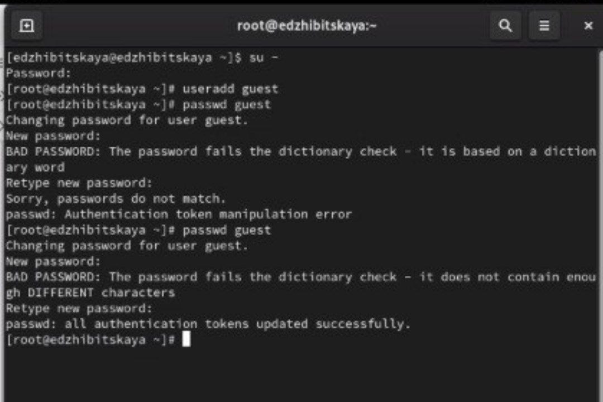
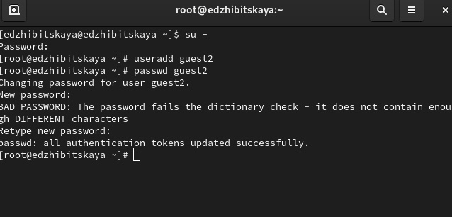
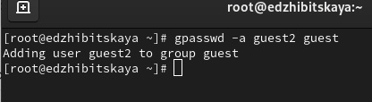
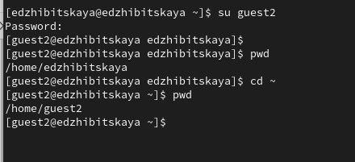
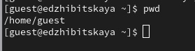
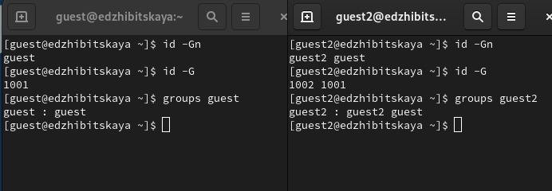
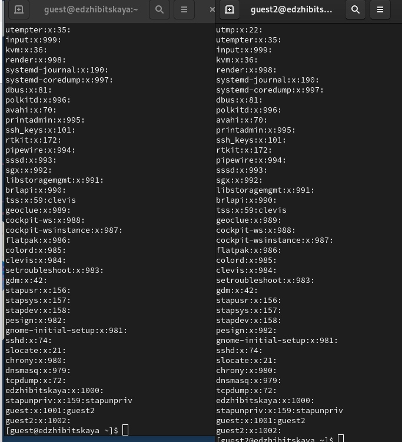
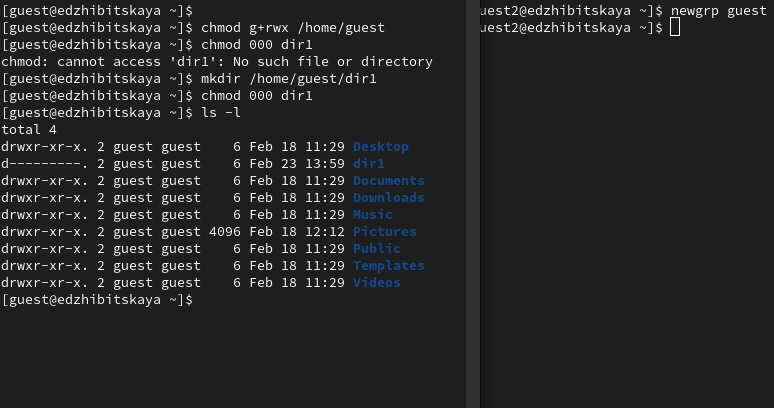
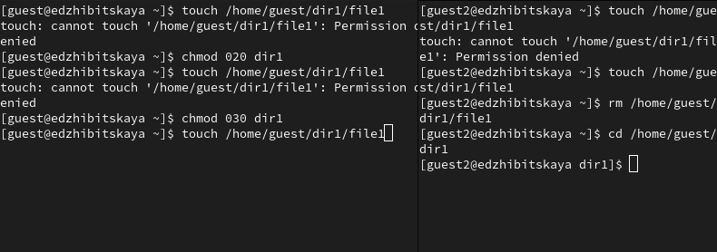
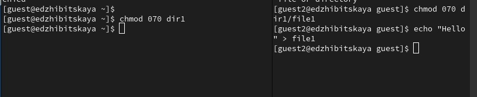

---
## Front matter
lang: ru-RU
title: Лабораторная №3
subtitle: Основы инофрмационной безопасности
author:
  - Жибицкая Е.Д.
institute:
  - Российский университет дружбы народов, Москва, Россия


## i18n babel
babel-lang: russian
babel-otherlangs: english

## Formatting pdf
toc: false
toc-title: Содержание
slide_level: 2
aspectratio: 169
section-titles: true
theme: metropolis
header-includes:
 - \metroset{progressbar=frametitle,sectionpage=progressbar,numbering=fraction}
---


# Цель

## Цель работы

- Продолжение работы на  Rocky, получение практических навыков работы в консоли с атрибутами файлов для групп пользователей.

# Ход работы 


## Создание пользователей

:::::::::::::: {.columns align=center}
::: {.column width="50%"}



:::
::: {.column width="40%"}



:::
::::::::::::::


## Добавление в группу

:::::::::::::: {.columns align=center}
::: {.column width="50%"}




:::

::::::::::::::


## Просмотр местонахождения 
:::::::::::::: {.columns align=center}
::: {.column width="50%"}



:::
::: {.column width="50%"}


:::
::::::::::::::

## Получение информации о группах
 
:::::::::::::: {.columns align=center}
::: {.column width="50%"}



:::
::: {.column width="40%"}



:::
::::::::::::::

## Разрешения и принадлежность

:::::::::::::: {.columns align=center}
::: {.column width="50%"}

Далее выполним регистрацию guest2 в группе guest, изменим права директории, разрешив все действия всем пользователя группы и, от имени guest снимем все разрешения с поддиректории dir1

:::
::: {.column width="50%"}


:::
::::::::::::::


## Работа с правами и разрешениями

:::::::::::::: {.columns align=center}
::: {.column width="50%"}



:::
::: {.column width="50%"}


:::
::::::::::::::

## Таблица 3.2 Минимальные права

|        Операция        | Права на директорию | Права на файл |
|------------------------|---------------------------------|---------------------------|
|     Создание файла     |           ```d----wx--- (030)```      |      ```---------- (000)```     |
|     Удаление файла     |           ```d----wx--- (030)```      |      ```---------- (000)```     |
|      Чтение файла      |           ```d-----x--- (010)```      |      ```----r----- (040)```     |
|      Запись в файл     |           ```d-----x--- (010)```      |      ```-----w---- (020)```     |
|  Переименование файла  |           ```d----wx--- (030)```      |      ```---------- (000)```     |
| Создание поддиректории |           ```d----wx--- (030)```      |      ```---------- (000)```     |
| Удаление поддиректории |           ```d----wx--- (030)```      |      ```---------- (000)```     |

# Выводы

## Вывод

- В ходе работы были приобретены навыки по работе с правами для групп пользователей, также определены минимально необходимые разрешения на различные действия

