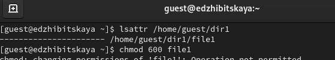
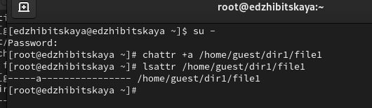
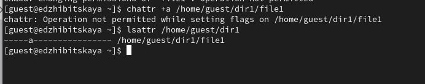
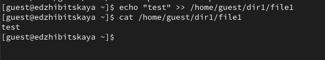
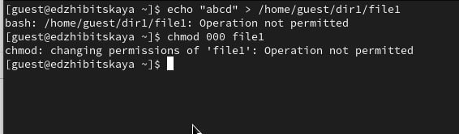
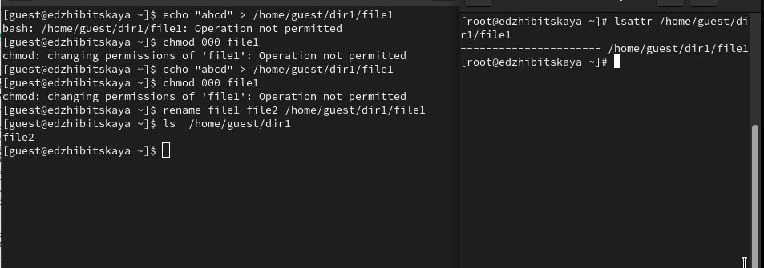
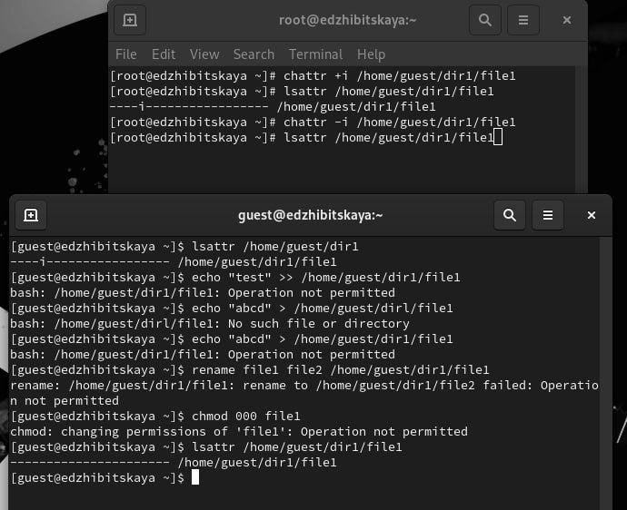

---
## Front matter
lang: ru-RU
title: Лабораторная №4
subtitle: Основы информационной безопасности
author:
  - Жибицкая Е.Д.
institute:
  - Российский университет дружбы народов, Москва, Россия

## i18n babel
babel-lang: russian
babel-otherlangs: english

## Formatting pdf
toc: false
toc-title: Содержание
slide_level: 2
aspectratio: 169
section-titles: true
theme: metropolis
header-includes:
 - \metroset{progressbar=frametitle,sectionpage=progressbar,numbering=fraction}
---

# Цель

## Цель работы

- Получение навыков работы в консоли с расширенными атрибутами на ОС Linux Rocky

# Ход работы 

## Просмотр атрибутов файла

:::::::::::::: {.columns align=center}
::: {.column width="50%"}

Сменяем сразу пользователя на guest и определяем расширенные атрибуты фалйа file1 и устанавливаем на него права на чтение и запись.

:::
::: {.column width="40%"}

:::
::::::::::::::

## Добавление +a

:::::::::::::: {.columns align=center}
::: {.column width="50%"}

:::
::: {.column width="50%"}

:::
::::::::::::::

## Работа с файлом
 
:::::::::::::: {.columns align=center}
::: {.column width="50%"}

:::
::: {.column width="40%"}

:::
::::::::::::::

## Снятие атрибута

:::::::::::::: {.columns align=center}
::: {.column width="70%"}

:::
::::::::::::::

## Атрибут +i

:::::::::::::: {.columns align=center}
::: {.column width="60%"}

:::
::::::::::::::

# Выводы

## Вывод

- В ходе работы были повышены навыки использования консоли при работе с атрибутами(основыными и расширенными) при разграничении доступа

