---
## Front matter
lang: ru-RU
title: Лабораторная №5
subtitle: Основы информационной безопасности
author:
  - Жибицкая Е.Д.
institute:
  - Российский университет дружбы народов, Москва, Россия

## i18n babel
babel-lang: russian
babel-otherlangs: english

## Formatting pdf
toc: false
toc-title: Содержание
slide_level: 2
aspectratio: 169
section-titles: true
theme: metropolis
header-includes:
 - \metroset{progressbar=frametitle,sectionpage=progressbar,numbering=fraction}
---

# Цель

## Цель работы

- Продолжение работы на ОС Rocky. Изучение механизмов изменения идентификаторов, применения SetUID- и Sticky-битов и рассмотрение работы механизма смены идентификатора процессов пользователей, а также влияние бита Sticky на запись и удаление файлов.

# Ход работы 

## Подготовка к работе

:::::::::::::: {.columns align=center}
::: {.column width="50%"}

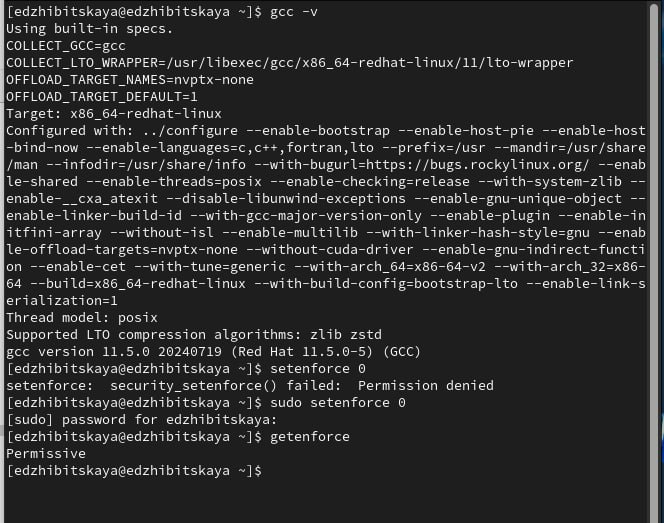

:::
::::::::::::::

## Simpleid.с

:::::::::::::: {.columns align=center}
::: {.column width="50%"}

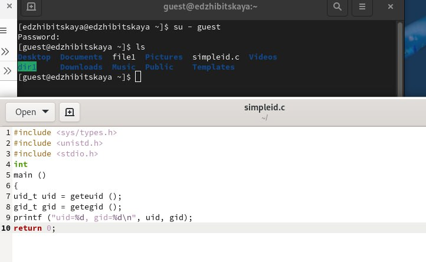

:::
::: {.column width="50%"}

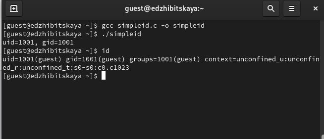

:::
::::::::::::::

## Simpleid2.c
:::::::::::::: {.columns align=center}
::: {.column width="50%"}

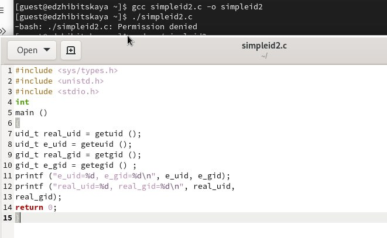
:::
::::::::::::::

## Добавление прав и владельца
 
:::::::::::::: {.columns align=center}
::: {.column width="50%"}

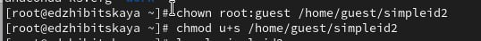

:::
::: {.column width="40%"}

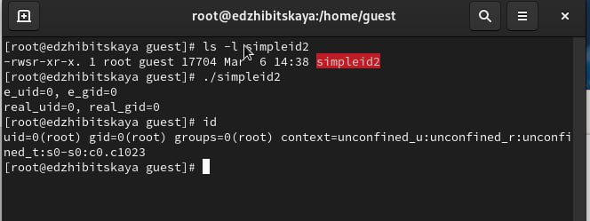
:::
::::::::::::::

## Readfile

:::::::::::::: {.columns align=center}
::: {.column width="50%"}

Создадим файл, предназначенный для считывния файлов, вставим код и скомпилируем его
:::
::: {.column width="50%"}

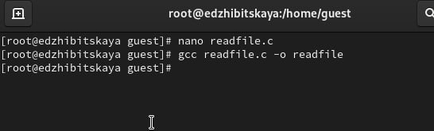
:::
::::::::::::::

## Запуск Readfile

:::::::::::::: {.columns align=center}
::: {.column width="50%"}

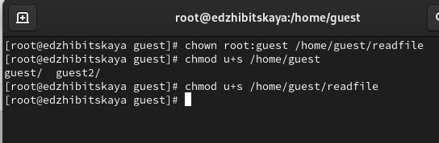
:::
::: {.column width="50%"}

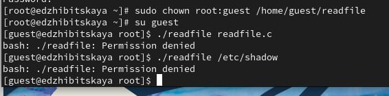
:::
::::::::::::::

## Sticky-bit
:::::::::::::: {.columns align=center}
::: {.column width="50%"}

 Сначала проверем установлен ли на директорию stiky-бит, запишем в него сообщение. Посмотрим на установленные права, разрешим чтение и запись для всех остальных пользователей.
:::
::: {.column width="50%"}

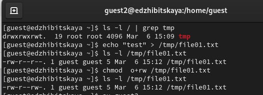
:::
::::::::::::::

## Выполнение команд от guest2
:::::::::::::: {.columns align=center}
::: {.column width="50%"}

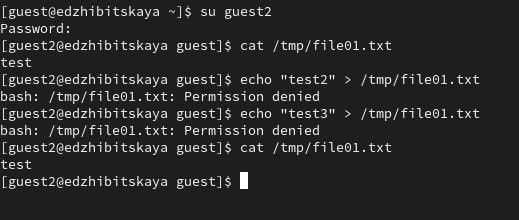{#fig:011 width=70%}
:::
::: {.column width="50%"}
От пользователя guest2 прочитаем файл, попробуем записать туда текст(безуспешно)Попробуем удалить файл - также безуспешно.
:::
::::::::::::::

## Удаление sticky-bit
:::::::::::::: {.columns align=center}
::: {.column width="50%"}

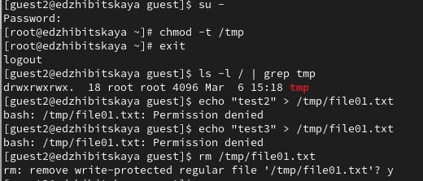
:::
::::::::::::::

## Возвращение sticky-bit
:::::::::::::: {.columns align=center}
::: {.column width="50%"}

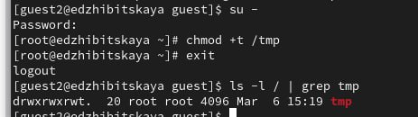
:::
::::::::::::::

# Выводы

## Вывод

-  В ходе работы были изучены механизмы изменения идентификаторов, применения
SetUID- и Sticky-битов а также влияние бита Sticky на запись и удаление файлов.

