---
## Front matter
title: "Лабораторная работа №5"
subtitle: "Дисциплина: Основы информационной безопасности"
author: "Жибицкая Евгения Дмитриевна"

## Generic otions
lang: ru-RU
toc-title: "Содержание"

## Bibliography
bibliography: bib/cite.bib
csl: pandoc/csl/gost-r-7-0-5-2008-numeric.csl

## Pdf output format
toc: true # Table of contents
toc-depth: 2
lof: true # List of figures
lot: true # List of tables
fontsize: 12pt
linestretch: 1.5
papersize: a4
documentclass: scrreprt
## I18n polyglossia
polyglossia-lang:
  name: russian
  options:
	- spelling=modern
	- babelshorthands=true
polyglossia-otherlangs:
  name: english
## I18n babel
babel-lang: russian
babel-otherlangs: english
## Fonts
mainfont: IBM Plex Serif
romanfont: IBM Plex Serif
sansfont: IBM Plex Sans
monofont: IBM Plex Mono
mathfont: STIX Two Math
mainfontoptions: Ligatures=Common,Ligatures=TeX,Scale=0.94
romanfontoptions: Ligatures=Common,Ligatures=TeX,Scale=0.94
sansfontoptions: Ligatures=Common,Ligatures=TeX,Scale=MatchLowercase,Scale=0.94
monofontoptions: Scale=MatchLowercase,Scale=0.94,FakeStretch=0.9
mathfontoptions:
## Biblatex
biblatex: true
biblio-style: "gost-numeric"
biblatexoptions:
  - parentracker=true
  - backend=biber
  - hyperref=auto
  - language=auto
  - autolang=other*
  - citestyle=gost-numeric
## Pandoc-crossref LaTeX customization
figureTitle: "Рис."
tableTitle: "Таблица"
listingTitle: "Листинг"
lofTitle: "Список иллюстраций"
lotTitle: "Список таблиц"
lolTitle: "Листинги"
## Misc options
indent: true
header-includes:
  - \usepackage{indentfirst}
  - \usepackage{float} # keep figures where there are in the text
  - \floatplacement{figure}{H} # keep figures where there are in the text
---

# Цель работы

Продолжение работы на ОС Rocky. Изучение механизмов изменения идентификаторов, применения SetUID- и Sticky-битов и рассмотрение работы механизма смены идентификатора процессов пользователей, а также влияние бита Sticky на запись и удаление файлов.


# Выполнение лабораторной работы

Перед началом выполнения проверим наличие у нас gcc, а также установим setenforce на 0 (рис. [-@fig:001]).

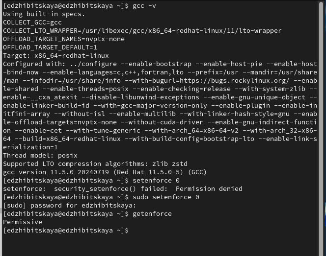{#fig:001 width=70%}

Далее приступим к работе. От имени пользователя создаем файл и вставляем туда код по получению информации о пользователе(рис. [-@fig:002]).

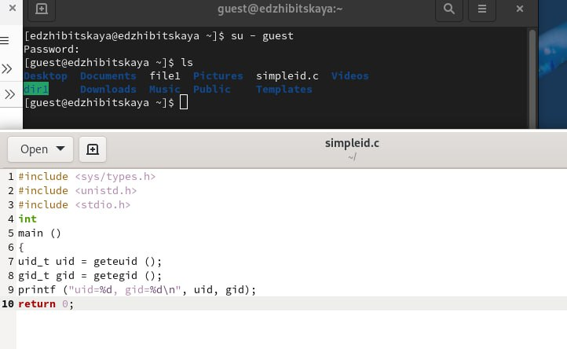{#fig:002 width=70%}

Компилируем его, запускаем и смотрим на вывод. Также сравним результат программы с выводом команды id(рис. [-@fig:003]).

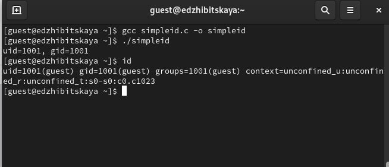{#fig:003 width=70%}

Доработаем код, переимнуем файл на simpleid.2 и также скомпилируем и запустим(рис. [-@fig:004]).

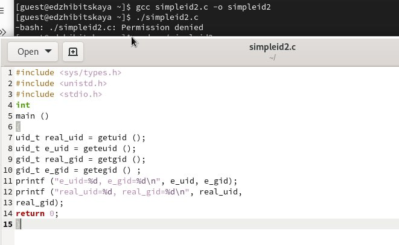{#fig:004 width=70%}

Далее от администратора добавим его как владельца и повысим права на этот файл(рис. [-@fig:005]). Проверим, что все хорошо и запустим его. Сравним с командой id(рис. [-@fig:006]).

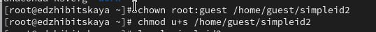{#fig:005 width=70%}

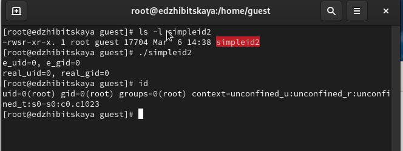{#fig:006 width=70%}


Затем создадим файл readfile, вставим код 

```c

#include <fcntl.h>
#include <stdio.h>
#include <sys/stat.h>
#include <sys/types.h>
#include <unistd.h>
int
main (int argc, char* argv[])
{
unsigned char buffer[16];
size_t bytes_read;
int i;
int fd = open (argv[1], O_RDONLY);
do
{
bytes_read = read (fd, buffer, sizeof (buffer));
for (i =0; i < bytes_read; ++i) printf("%c", buffer[i]);
}
while (bytes_read == sizeof (buffer));
close (fd);
return 0;
}

```
и скомпилируем его(рис. [-@fig:007]).

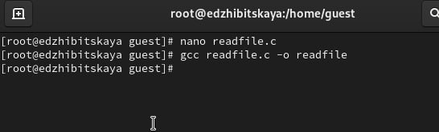{#fig:007 width=70%}

 Сменим владельца у файла и повысим на него права(рис. [-@fig:008]).

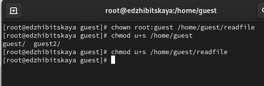{#fig:008 width=70%}

 Перейдем в пользователя guest, сменим у программы readfile владельца и установим SetU’D-бит, попробуем запустить файл - получим отказ в доступе(рис. [-@fig:009).

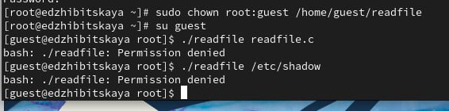{#fig:009 width=70%}

 Перейдем к следующему заданию. 
 
 Сначала проверем установлен ли на директорию stiky-бит, запишем в него сообщение. Посмотрим на установленные права, разрешим чтение и запись для всех остальных пользователей (рис. [-@fig:010).

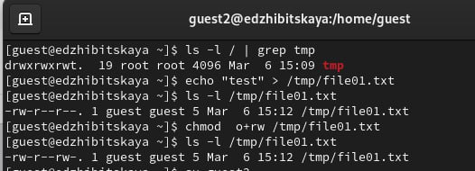{#fig:010 width=70%}

 От пользователя guest2 прочитаем файл, попробуем записать туда текст(безуспешно)Попробуем удалить файл - также безуспешно(рис. [-@fig:011) и рис. [-@fig:012).

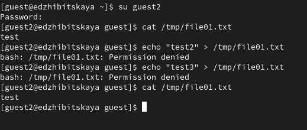{#fig:011 width=70%}


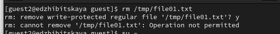{#fig:012 width=70%}

 Получив необходимые полномочия, уберем sticky-бит, повторим те же действия и уже удалим файл(рис. [-@fig:013).

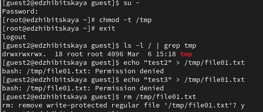{#fig:013 width=70%}

 Вернем бит и завершим выполнение работырис. [-@fig:014).

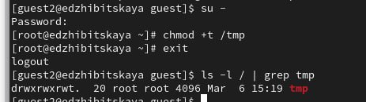{#fig:014 width=70%}


# Выводы

 В ходе работы были изучены механизмы изменения идентификаторов, применения
SetUID- и Sticky-битов а также влияние бита Sticky на запись и удаление файлов.

# Список литературы{.unnumbered}

[ТУИС](https://esystem.rudn.ru/pluginfile.php/2580984/mod_resource/content/2/005-lab_discret_sticky.pdf)

