---
## Front matter
lang: ru-RU
title: Лабораторная №6
subtitle: Основы информационной безопасности
author:
  - Жибицкая Е.Д.
institute:
  - Российский университет дружбы народов, Москва, Россия

## i18n babel
babel-lang: russian
babel-otherlangs: english

## Formatting pdf
toc: false
toc-title: Содержание
slide_level: 2
aspectratio: 169
section-titles: true
theme: metropolis
header-includes:
 - \metroset{progressbar=frametitle,sectionpage=progressbar,numbering=fraction}
---

# Цель

## Цель работы

- Развитие навыков администрирования ОС Linux. Знакомство с технологией SELinux1 и проверка работы SELinx на практике совместно с веб-сервером Аpache

# Ход работы 

## Подготовка к работе
:::::::::::::: {.columns align=center}
::: {.column width="50%"}

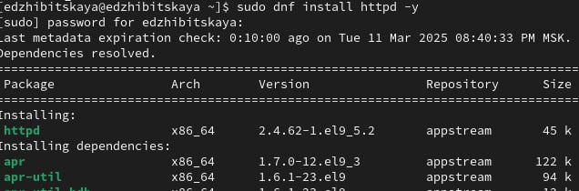

:::
::: {.column width="50%"}

Сначала проведем подготовительные действия: для работы необходим Apache  - установим его, также уберем пакетный фильтр.

:::
::::::::::::::

## Статус рвботы 
:::::::::::::: {.columns align=center}
::: {.column width="50%"}

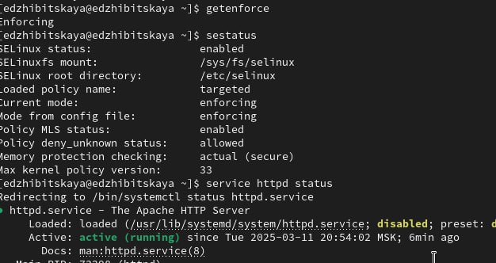

:::
::::::::::::::

## Apache
 
:::::::::::::: {.columns align=center}
::: {.column width="50%"}

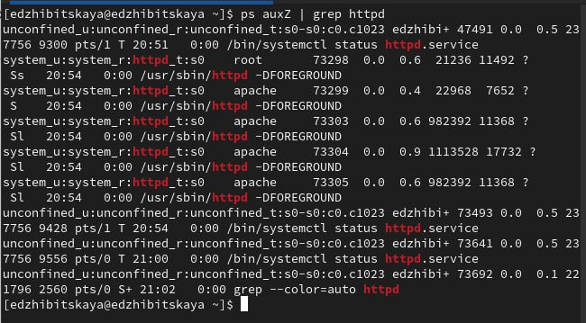

:::
::: {.column width="40%"}

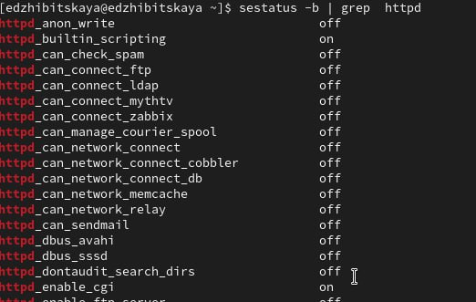
:::
::::::::::::::

## Просмотр информации

:::::::::::::: {.columns align=center}
::: {.column width="50%"}

Посмотрим статистику по политике с помощью команды seinfo, также определим множество пользователей, ролей, типов.
:::
::: {.column width="50%"}

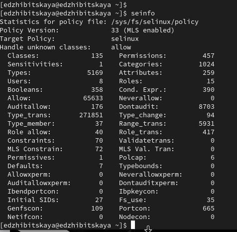
:::
::::::::::::::

## Определние типа файлов в каталоге, создание нового

:::::::::::::: {.columns align=center}
::: {.column width="50%"}

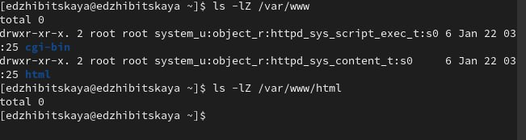
:::
::: {.column width="50%"}

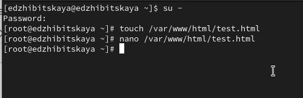
:::
::::::::::::::

## Test.html
:::::::::::::: {.columns align=center}
::: {.column width="50%"}
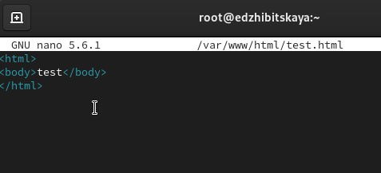
:::
::: {.column width="50%"}

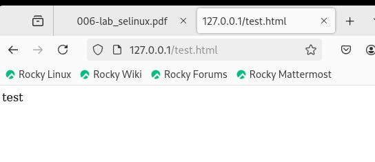
:::
::::::::::::::

## Контекст файла
:::::::::::::: {.columns align=center}
::: {.column width="50%"}

Далее проверим контекст файла командой ls -Z и изучим его подробно. Изменим его на samba_share_t и убедимся, что это произошло.
:::
::: {.column width="50%"}
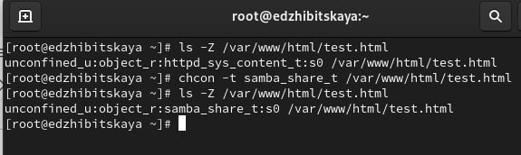
:::
::::::::::::::

## Проверка сервера
:::::::::::::: {.columns align=center}
::: {.column width="50%"}

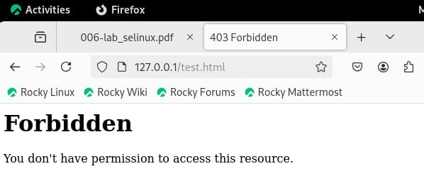

:::
::::::::::::::

## Лог-файлы
:::::::::::::: {.columns align=center}
::: {.column width="50%"}

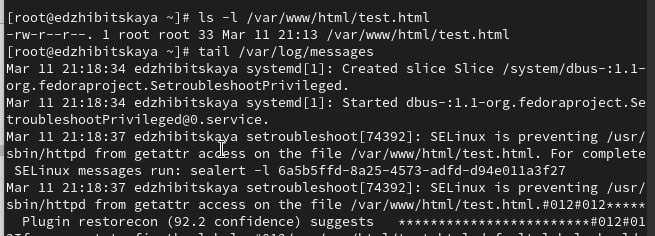
:::
::: {.column width="50%"}

Просмотрим log-файлы веб-сервера Apache. Также просмотрим системный лог-файл.
Если в системе окажутся запущенными процессы setroubleshootd и
audtd, то сможем увидеть ошибки, аналогичные указанным
выше, в файле /var/log/audit/audit.log
:::
::::::::::::::

## Смена порта
:::::::::::::: {.columns align=center}
::: {.column width="50%"}

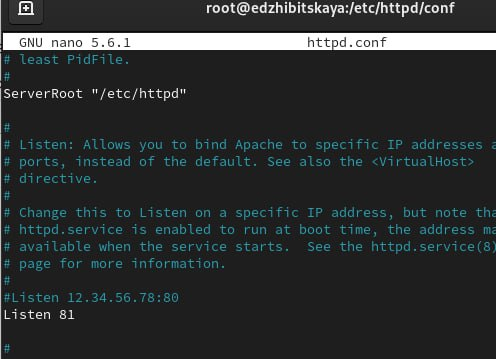
:::
::: {.column width="50%"}
Попробуем  запустить веб-сервер Apache на прослушивание ТСР-порта
81 Для этого в файле /etc/httpd/httpd.conf  строчку Listen 80 заменим на Listen 81.
:::
::::::::::::::

##  Анализ файлов
:::::::::::::: {.columns align=center}
::: {.column width="50%"}

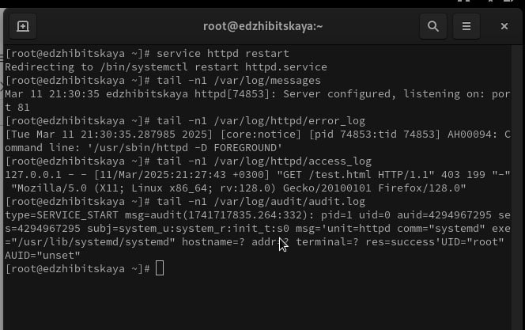
:::
::: {.column width="50%"}
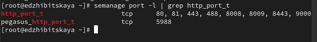
:::
::::::::::::::

## Повторный запуск
:::::::::::::: {.columns align=center}
::: {.column width="50%"}

Вернем контекст httpd_sys_cоntent__t к файлу /var/www/html/ test.html и попробуем получить доступ к файлу через веб-сервер, введя в браузере адрес http://127.0.0.1:81/test.html
:::
::: {.column width="50%"}

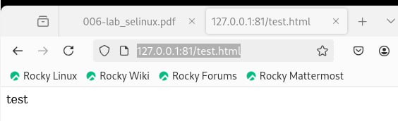
:::
::::::::::::::

## Завершение работы
:::::::::::::: {.columns align=center}
::: {.column width="50%"}
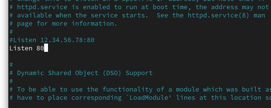
:::
::: {.column width="50%"}

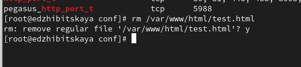

:::
::::::::::::::

# Выводы

## Вывод

-  В ходе работы было произведено знакомство с Apache и Selinux, получены навыки по работе с ними и взаимодействию с веб-сервером

