---
## Front matter
title: "Лабораторная работа №6"
subtitle: "Дисциплина: Основы информационной безопасности"
author: "Жибицкая Евгения Дмитриевна"

## Generic otions
lang: ru-RU
toc-title: "Содержание"

## Bibliography
bibliography: bib/cite.bib
csl: pandoc/csl/gost-r-7-0-5-2008-numeric.csl

## Pdf output format
toc: true # Table of contents
toc-depth: 2
lof: true # List of figures
lot: true # List of tables
fontsize: 12pt
linestretch: 1.5
papersize: a4
documentclass: scrreprt
## I18n polyglossia
polyglossia-lang:
  name: russian
  options:
	- spelling=modern
	- babelshorthands=true
polyglossia-otherlangs:
  name: english
## I18n babel
babel-lang: russian
babel-otherlangs: english
## Fonts
mainfont: IBM Plex Serif
romanfont: IBM Plex Serif
sansfont: IBM Plex Sans
monofont: IBM Plex Mono
mathfont: STIX Two Math
mainfontoptions: Ligatures=Common,Ligatures=TeX,Scale=0.94
romanfontoptions: Ligatures=Common,Ligatures=TeX,Scale=0.94
sansfontoptions: Ligatures=Common,Ligatures=TeX,Scale=MatchLowercase,Scale=0.94
monofontoptions: Scale=MatchLowercase,Scale=0.94,FakeStretch=0.9
mathfontoptions:
## Biblatex
biblatex: true
biblio-style: "gost-numeric"
biblatexoptions:
  - parentracker=true
  - backend=biber
  - hyperref=auto
  - language=auto
  - autolang=other*
  - citestyle=gost-numeric
## Pandoc-crossref LaTeX customization
figureTitle: "Рис."
tableTitle: "Таблица"
listingTitle: "Листинг"
lofTitle: "Список иллюстраций"
lotTitle: "Список таблиц"
lolTitle: "Листинги"
## Misc options
indent: true
header-includes:
  - \usepackage{indentfirst}
  - \usepackage{float} # keep figures where there are in the text
  - \floatplacement{figure}{H} # keep figures where there are in the text
---
# Цель работы

Развитие навыков администрирования ОС Linux. Знакомство с технологией SELinux1 и проверка работы SELinx на практике совместно с веб-сервером Аpache.

# Выполнение лабораторной работы

Сначала проведем подготовительные действия: для работы необходим Apache  - установим его, также уберем пакетный фильтр (рис. [-@fig:001]).

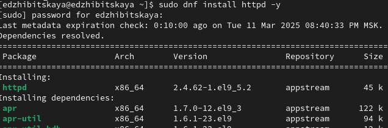{#fig:001 width=70%}

Проверим, в каком состоянии находятся службы Selinux и веб-сервер(рис. [-@fig:002]).

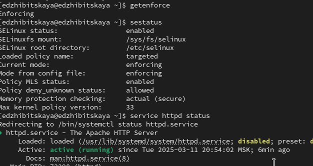{#fig:002 width=70%}

Найдем веб-сервер Apache в списке процессов, определим его контекст безопасности(рис. [-@fig:003]), посмотрим текущее состояние переключателей SELinux для Apache( многие из них выключены)(рис. [-@fig:004]).

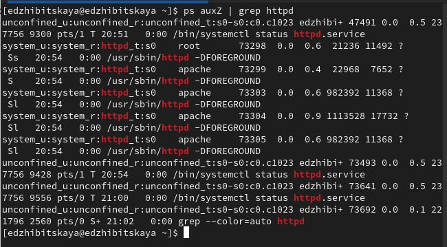{#fig:003 width=70%}

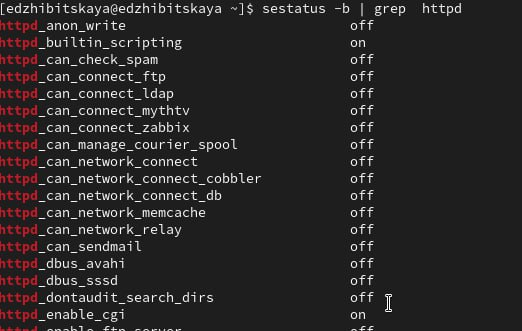{#fig:004 width=70%}

Посмотрим статистику по политике с помощью команды seinfo, также определим множество пользователей, ролей, типов(рис. [-@fig:005]).

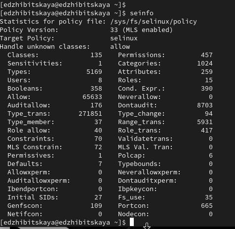{#fig:005 width=70%}

Посмотрим на содержимое каталогов и определим тип файлов(рис. [-@fig:006]).

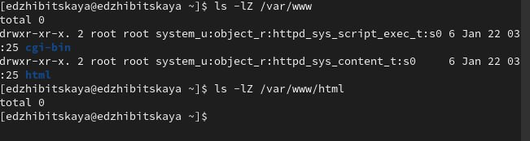{#fig:006 width=70%}

От имени администратора создадим файл test.html, добавим туда содержимое(рис. [-@fig:007]) и (рис. [-@fig:008]), перейдем по нужному адресу и посмотрим все ли отображается(рис. [-@fig:009]).

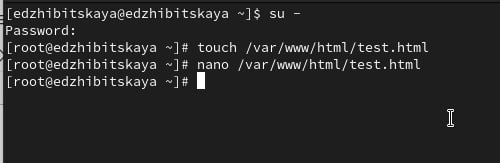{#fig:007 width=70%}

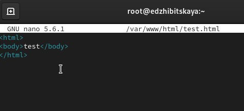{#fig:008 width=70%}

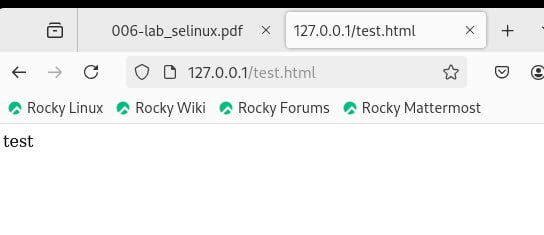{#fig:009 width=70%}

Далее проверим контекст файла командой ls -Z и изучим его подробно. Изменим его на samba_share_t и убедимся, что это произошло(рис. [-@fig:010]).

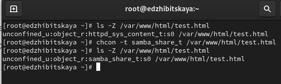{#fig:010 width=70%}

Затем еще раз перейдем на веб-сервер - доступа нет(рис. [-@fig:011]).

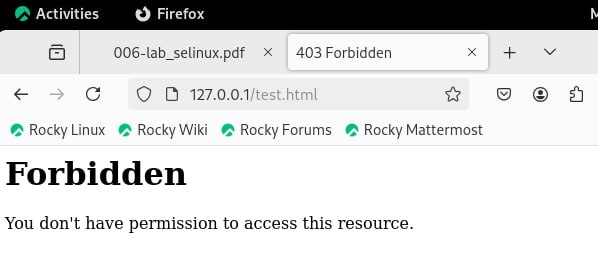{#fig:011 width=70%}

Просмотрим log-файлы веб-сервера Apache. Также просмотрим системный лог-файл.
Если в системе окажутся запущенными процессы setroubleshootd и
audtd, то сможем увидеть ошибки, аналогичные указанным
выше, в файле /var/log/audit/audit.log(рис. [-@fig:012]) и (рис. [-@fig:013]).

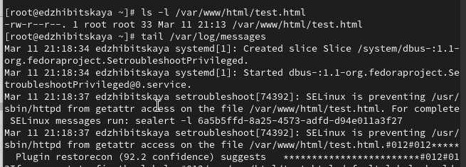{#fig:012 width=70%}

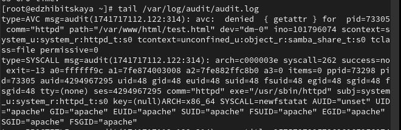{#fig:013 width=70%}

Попробуем  запустить веб-сервер Apache на прослушивание ТСР-порта
81 Для этого в файле /etc/httpd/httpd.conf  строчку Listen 80 заменим на Listen 81(рис. [-@fig:014]).

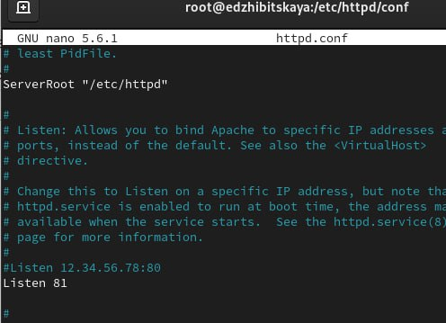{#fig:014 width=70%}

Перезапустим веб-сервер Apache, проанализируем лог-файлы:
/var/log/messages, /var/log/http/error_log,
/var/log/http/access_log и /var/log/audit/audit.log и
выясним в каких файлах появились записи(рис. [-@fig:015]).

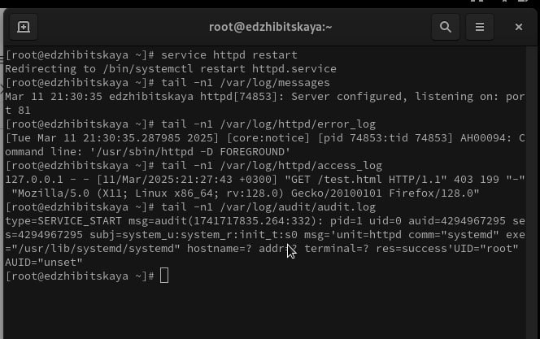{#fig:015 width=70%}

Выполним команду

semanage port -a -t http_port_t -р tcp 81

и проверим список портов командой(рис. [-@fig:016]).

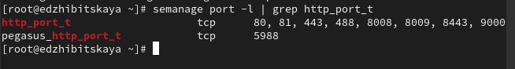{#fig:016 width=70%}

Попробуем  запустить веб-сервер Apache ещё раз.

Вернем контекст httpd_sys_cоntent__t к файлу /var/www/html/ test.html и попробуем получить доступ к файлу через веб-сервер, введя в браузере адрес http://127.0.0.1:81/test.html(рис. [-@fig:017]).

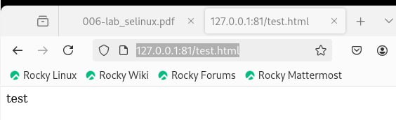{#fig:017 width=70%}

Исправим  обратно конфигурационный файл apache, вернув Listen 80(рис. [-@fig:018]), удалим привязку http_port_t к 81 порту, удалим  файл /var/www/html/test.html(рис. [-@fig:019]).

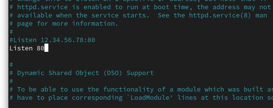{#fig:018 width=70%}

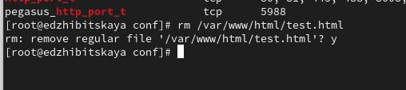{#fig:019 width=70%}

# Выводы

В ходе работы было произведено знакомство с Apache и Selinux, получены навыки по работе с ними и взаимодействию с веб-сервером

# Список литературы{.unnumbered}

[ТУИС](https://esystem.rudn.ru/pluginfile.php/2580986/mod_resource/content/2/006-lab_selinux.pdf)

