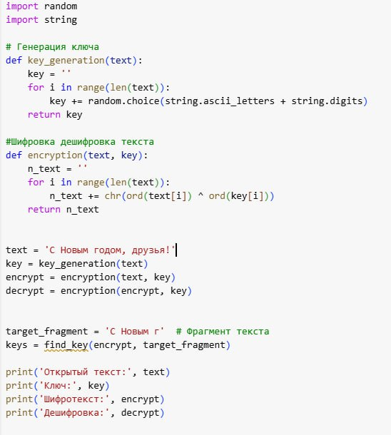
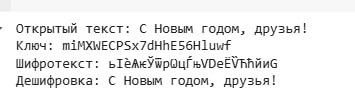
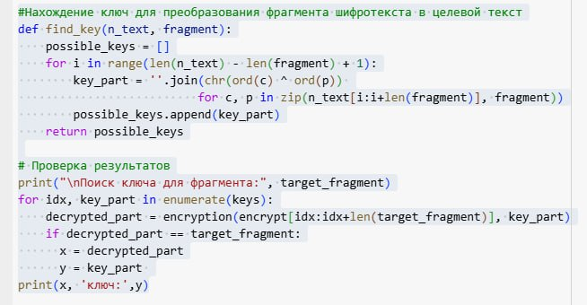
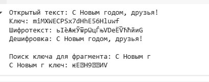

---
## Front matter
lang: ru-RU
title: Лабораторная №7
subtitle: Основы информационной безопасности
author:
  - Жибицкая Е.Д.
institute:
  - Российский университет дружбы народов, Москва, Россия

## i18n babel
babel-lang: russian
babel-otherlangs: english

## Formatting pdf
toc: false
toc-title: Содержание
slide_level: 2
aspectratio: 169
section-titles: true
theme: metropolis
header-includes:
 - \metroset{progressbar=frametitle,sectionpage=progressbar,numbering=fraction}
---

# Цель

## Цель работы

- Освоение на практике применения режима однократного гаммирования, разработка приложения, позволяющего шифровать и дешифровать данные в режиме однократного гаммирования

# Ход работы 

## Задание
:::::::::::::: {.columns align=center}
::: {.column width="80%"}

Нужно подобрать ключ, чтобы получить сообщение «С Новым Годом, друзья!». Требуется разработать приложение, позволяющее шифровать и дешифровать данные в режиме однократного гаммирования. Приложение должно:

1. Определить вид шифротекста при известном ключе и известном открытом тексте.

2. Определить ключ, с помощью которого шифротекст может быть преобразован в некоторый фрагмент текста, представляющий собой один из возможных вариантов прочтения текста.

:::
::::::::::::::

## 1 часть
:::::::::::::: {.columns align=center}
::: {.column width="40%"}

:::
::: {.column width="50%"}

{#fig:002 width=70%}

:::
::::::::::::::

## 2 часть

:::::::::::::: {.columns align=center}
::: {.column width="50%"}

:::
::: {.column width="50%"}

:::
::::::::::::::

# Выводы

## Вывод

-  В ходе работы при получены навыки однократного гаммирования, реализована программа осуществляющая шифровку и дешифровку данных

