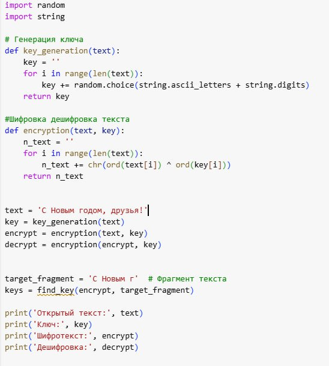
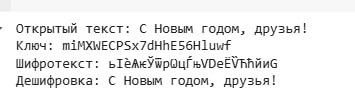
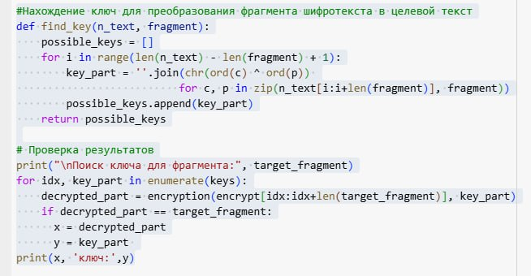
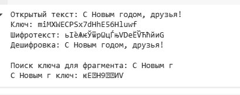

---
## Front matter
title: "Лабораторная №7"
subtitle: "Дисциплина: Основы информационной безопасности"
author: "Жибицкая Евгения Дмитриевна"

## Generic otions
lang: ru-RU
toc-title: "Содержание"

## Bibliography
bibliography: bib/cite.bib
csl: pandoc/csl/gost-r-7-0-5-2008-numeric.csl

## Pdf output format
toc: true # Table of contents
toc-depth: 2
lof: true # List of figures
lot: true # List of tables
fontsize: 12pt
linestretch: 1.5
papersize: a4
documentclass: scrreprt
## I18n polyglossia
polyglossia-lang:
  name: russian
  options:
	- spelling=modern
	- babelshorthands=true
polyglossia-otherlangs:
  name: english
## I18n babel
babel-lang: russian
babel-otherlangs: english
## Fonts
mainfont: IBM Plex Serif
romanfont: IBM Plex Serif
sansfont: IBM Plex Sans
monofont: IBM Plex Mono
mathfont: STIX Two Math
mainfontoptions: Ligatures=Common,Ligatures=TeX,Scale=0.94
romanfontoptions: Ligatures=Common,Ligatures=TeX,Scale=0.94
sansfontoptions: Ligatures=Common,Ligatures=TeX,Scale=MatchLowercase,Scale=0.94
monofontoptions: Scale=MatchLowercase,Scale=0.94,FakeStretch=0.9
mathfontoptions:
## Biblatex
biblatex: true
biblio-style: "gost-numeric"
biblatexoptions:
  - parentracker=true
  - backend=biber
  - hyperref=auto
  - language=auto
  - autolang=other*
  - citestyle=gost-numeric
## Pandoc-crossref LaTeX customization
figureTitle: "Рис."
tableTitle: "Таблица"
listingTitle: "Листинг"
lofTitle: "Список иллюстраций"
lotTitle: "Список таблиц"
lolTitle: "Листинги"
## Misc options
indent: true
header-includes:
  - \usepackage{indentfirst}
  - \usepackage{float} # keep figures where there are in the text
  - \floatplacement{figure}{H} # keep figures where there are in the text
---

# Цель работы

Освоение на практике применения режима однократного гаммирования, разработка приложения, позволяющего шифровать и дешифровать данные в режиме однократного гаммирования.

# Задание

Нужно подобрать ключ, чтобы получить сообщение «С Новым Годом, друзья!». Требуется разработать приложение, позволяющее шифровать и дешифровать данные в режиме однократного гаммирования. Приложение должно:

1. Определить вид шифротекста при известном ключе и известном открытом тексте.

2. Определить ключ, с помощью которого шифротекст может быть преобразован в некоторый фрагмент текста, представляющий собой один из возможных вариантов прочтения текста.


# Выполнение лабораторной работы

Код будет реализован на языке python, испоьзуем collab для его написания.
Для выполнения первого пункта напишем основные функции - генерация ключа с использованием random, шифровка/дешифровка на основе сложения по модулю 2(рис. [-@fig:001]).

{#fig:001 width=70%}

Запустим ее, убедимся, что все работает(рис. [-@fig:002]).

{#fig:002 width=70%}

Далее реализуем функцию преобразования фрагмента текста и посмотри на ее вывод(рис. [-@fig:003]).

{#fig:003 width=70%}

Результат работы программы(рис. [-@fig:004]).

{#fig:004 width=70%}


* Листинг программы

```
import random
import string

# Генерация ключа
def key_generation(text):
    key = ''
    for i in range(len(text)):
        key += random.choice(string.ascii_letters + string.digits)
    return key

#Шифровка дешифровка текста
def encryption(text, key):
    n_text = ''
    for i in range(len(text)):
        n_text += chr(ord(text[i]) ^ ord(key[i]))
    return n_text

#Нахождение ключ для преобразования фрагмента шифротекста в целевой текст
def find_key(n_text, fragment):
    possible_keys = []
    for i in range(len(n_text) - len(fragment) + 1):
        key_part = ''.join(chr(ord(c) ^ ord(p)) 
                          for c, p in zip(n_text[i:i+len(fragment)], fragment))
        possible_keys.append(key_part)
    return possible_keys

text = 'С Новым годом, друзья'
key = key_generation(text)
encrypt = encryption(text, key)
decrypt = encryption(encrypt, key)


target_fragment = 'С Новым г'  # Фрагмент текста
keys = find_key(encrypt, target_fragment)

print('Открытый текст:', text)
print('Ключ:', key)
print('Шифротекст:', encrypt)
print('Дешифровка:', decrypt)

# Проверка результатов
print("\nПоиск ключа для фрагмента:", target_fragment)
for idx, key_part in enumerate(keys):
    decrypted_part = encryption(encrypt[idx:idx+len(target_fragment)], key_part)
    if decrypted_part == target_fragment:
      x = decrypted_part
      y = key_part 
print(x, 'ключ:',y)
```

# Выводы

В ходе работы при получены навыки однократного гаммирования, реализована программа осуществляющая шифровку и дешифровку данных.


