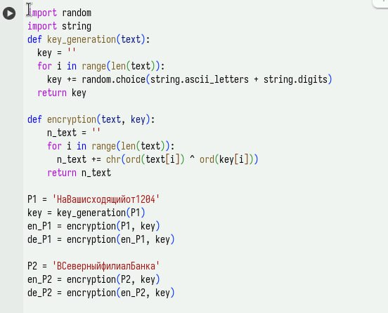
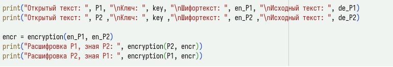
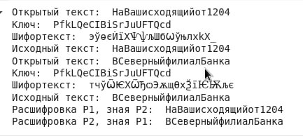

---
## Front matter
lang: ru-RU
title: Лабораторная №8
subtitle: Основы информационной безопасности
author:
  - Жибицкая Е.Д.
institute:
  - Российский университет дружбы народов, Москва, Россия

## i18n babel
babel-lang: russian
babel-otherlangs: english

## Formatting pdf
toc: false
toc-title: Содержание
slide_level: 2
aspectratio: 169
section-titles: true
theme: metropolis
header-includes:
 - \metroset{progressbar=frametitle,sectionpage=progressbar,numbering=fraction}
---

# Цель

## Цель работы

 - Освоение на практике применения режима однократного гаммирования на примере кодирования различных исходных текстов одним ключом.

# Ход работы 

## Задание

Два текста кодируются одним ключом (однократное гаммирование).
Требуется не зная ключа и не стремясь его определить, прочитать оба текста. Необходимо разработать приложение, позволяющее шифровать и дешифровать тексты P1 и P2 в режиме однократного гаммирования. Приложение должно определить вид шифротекстов C1 и C2 обоих текстов P1 и
P2 при известном ключе ; Необходимо определить и выразить аналитически способ, при котором злоумышленник может прочитать оба текста, не зная ключа и не стремясь его определить.

## Реализация
:::::::::::::: {.columns align=center}
::: {.column width="50%"}

Для выполнения данной лабораторной работы воспользуемся программой, написанной в предыдущей лабораторной работе №7. Зашифруем исходные сообщения, предварительно сгенерировав ключ.
:::
::: {.column width="40%"}

:::
::::::::::::::

## Реализация

:::::::::::::: {.columns align=center}
::: {.column width="45%"}

:::
::: {.column width="50%"}

Затем сгенерируем шифротекст, посмотрим на вывод программы.
Также выполним задание и расшифруем сообщение 1 за счет сообщения 2 и наоборот(для этого также используем сложение по модулю 2).
:::
::::::::::::::

## Результат

:::::::::::::: {.columns align=center}
::: {.column width="45%"}

:::
::::::::::::::

# Выводы

## Вывод

- В ходе работы было произведено повторное знакомство с элементами криптографии, произведена шифровка и дешифровка даннных с помощью ключа, расшифровка сообщений, закодированных одним ключом без ключа, зная только сообщения

