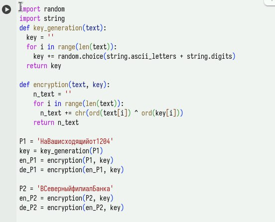
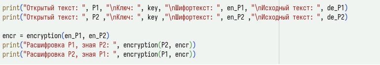
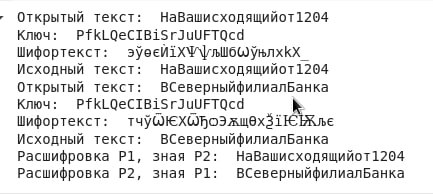

---
## Front matter
title: "Лабораторная №8"
subtitle: "Дисциплина: Основы информационной безопасности"
author: "Жибицкая Евгения Дмитриевна"

## Generic otions
lang: ru-RU
toc-title: "Содержание"

## Bibliography
bibliography: bib/cite.bib
csl: pandoc/csl/gost-r-7-0-5-2008-numeric.csl

## Pdf output format
toc: true # Table of contents
toc-depth: 2
lof: true # List of figures
lot: true # List of tables
fontsize: 12pt
linestretch: 1.5
papersize: a4
documentclass: scrreprt
## I18n polyglossia
polyglossia-lang:
  name: russian
  options:
	- spelling=modern
	- babelshorthands=true
polyglossia-otherlangs:
  name: english
## I18n babel
babel-lang: russian
babel-otherlangs: english
## Fonts
mainfont: IBM Plex Serif
romanfont: IBM Plex Serif
sansfont: IBM Plex Sans
monofont: IBM Plex Mono
mathfont: STIX Two Math
mainfontoptions: Ligatures=Common,Ligatures=TeX,Scale=0.94
romanfontoptions: Ligatures=Common,Ligatures=TeX,Scale=0.94
sansfontoptions: Ligatures=Common,Ligatures=TeX,Scale=MatchLowercase,Scale=0.94
monofontoptions: Scale=MatchLowercase,Scale=0.94,FakeStretch=0.9
mathfontoptions:
## Biblatex
biblatex: true
biblio-style: "gost-numeric"
biblatexoptions:
  - parentracker=true
  - backend=biber
  - hyperref=auto
  - language=auto
  - autolang=other*
  - citestyle=gost-numeric
## Pandoc-crossref LaTeX customization
figureTitle: "Рис."
tableTitle: "Таблица"
listingTitle: "Листинг"
lofTitle: "Список иллюстраций"
lotTitle: "Список таблиц"
lolTitle: "Листинги"
## Misc options
indent: true
header-includes:
  - \usepackage{indentfirst}
  - \usepackage{float} # keep figures where there are in the text
  - \floatplacement{figure}{H} # keep figures where there are in the text
---

# Цель работы

Освоение на практике применения режима однократного гаммирования на примере кодирования различных исходных текстов одним ключом.


# Задание

Два текста кодируются одним ключом (однократное гаммирование).
Требуется не зная ключа и не стремясь его определить, прочитать оба текста. Необходимо разработать приложение, позволяющее шифровать и дешифровать тексты P1 и P2 в режиме однократного гаммирования. Приложение должно определить вид шифротекстов C1 и C2 обоих текстов P1 и
P2 при известном ключе ; Необходимо определить и выразить аналитически способ, при котором злоумышленник может прочитать оба текста, не зная ключа и не стремясь его определить.


# Выполнение лабораторной работы

Для выполнения данной лабораторной работы воспользуемся программой, написанной в предыдущей лабораторной работе №7. Зашифруем исходные сообщения, предварительно сгенерировав ключ(рис. [-@fig:001]).

{#fig:001 width=70%}

Затем сгенерируем шифротекст, посмотрим на вывод программы.
Также выполним задание и расшифруем сообщение 1 за счет сообщения 2 и наоборот(для этого также используем сложение по модулю 2)(рис. [-@fig:002]).

{#fig:002 width=70%}

Посмотрим на вывод программы - все проеобразования прошли успешно(рис. [-@fig:003]).

{#fig:003 width=70%}

# Листинг и вывод

``` Py
import random
import string
def key_generation(text):
  key = ''
  for i in range(len(text)):
    key += random.choice(string.ascii_letters + string.digits)
  return key

def encryption(text, key):
    n_text = ''
    for i in range(len(text)):
      n_text += chr(ord(text[i]) ^ ord(key[i]))
    return n_text

P1 = 'НаВашисходящийот1204'
key = key_generation(P1)
en_P1 = encryption(P1, key)
de_P1 = encryption(en_P1, key)

P2 = 'ВСеверныйфилиалБанка'
key = key_generation(P2)
en_P2 = encryption(P2, key)
de_P2 = encryption(en_P2, key)

print("Открытый текст: ", P1, "\nКлюч: ", key, "\nШифортекст: ", en_P1, "\nИсходный текст: ", de_P1)
print("Открытый текст: ", P2 ,"\nКлюч: ", key ,"\nШифортекст: ", en_P2 ,"\nИсходный текст: ", de_P2)

encr = encryption(de_P1, de_P2)
print("Расшифровка Р1, зная Р2: ", encryption(P2, encr))
print("Расшифровка Р2, зная Р1: ", encryption(P1, encr))
```

Вывод:

Открытый текст:  НаВашисходящийот1204 

Ключ:  PfkLQeCIBiSrJuUFTQcd 

Шифортекст:  эўѳєЍїХѰѱљШбѠўњлxkX_ 

Исходный текст:  НаВашисходящийот1204


Открытый текст:  ВСеверныйфилиалБанка 

Ключ:  PfkLQeCIBiSrJuUFTQcd 

Шифортекст:  тчўѾѤХѾЂѻЭѫщѲхѮїѤѬљє 

Исходный текст:  ВСеверныйфилиалБанка

Расшифровка Р1, зная Р2:  НаВашисходящийот1204

Расшифровка Р2, зная Р1:  ВСеверныйфилиалБанка

# Ответы на контрольные вопросы

1. Как, зная один из текстов (P1 или P2), определить другой, не зная при этом ключа?

  Если один и тот же ключ (K) был использован для шифрования двух открытых текстов (P1 и P2) с помощью однократного гаммирования, то:

  •  C1 = P1 XOR K 
  •  C2 = P2 XOR K 

  Зная C1 и C2, можно вычислить:

  •  C1 XOR C2 = (P1 XOR K) XOR (P2 XOR K) = P1 XOR P2 (Ключ K исключается)

  Теперь, зная P1 (один из открытых текстов), можно вычислить P2:

  •  P2 = (P1 XOR C1 XOR C2) или P2 = (C1 XOR C2) XOR P1


2. Что будет при повторном использовании ключа при шифровании текста?

  Повторное использование ключа при шифровании однократным гаммированием позволяет злоумышленнику, имеющему доступ к шифротекстам и знающему часть одного из открытых текстов, восстановить другой открытый текст.  Однократное гаммирование перестаёт быть однократным, и перестаёт быть безопасным.

3. Как реализуется режим шифрования однократного гаммирования одним ключом двух открытых текстов?

  1. Сгенерировать случайный ключ K длиной, равной длине самого длинного из двух открытых текстов (P1 и P2).
  2. Шифровать первый открытый текст: C1 = P1 XOR K
  3. Шифровать второй открытый текст: C2 = P2 XOR K


4. Перечислите недостатки шифрования одним ключом двух открытых текстов.

  •  Отсутствие безопасности: Зная один открытый текст и оба шифротекста, можно восстановить второй открытый текст.
  •  Возможность восстановления ключа: При наличии достаточного количества информации о открытых текстах или их структуре, возможна частичная или полная дедукция ключа.
  •  Уязвимость к частотному анализу: Если открытые тексты имеют предсказуемые элементы или повторяющиеся фрагменты, это упрощает криптоанализ.
  •  Нарушение принципа однократного использования: Главный принцип OTP - однократное использование ключа - полностью нарушен, что делает систему эквивалентной намного более слабым шифрам.

5. Перечислите преимущества шифрования одним ключом двух открытых текстов.

Их нет. Использование одного ключа для шифрования нескольких сообщений с помощью однократного гаммирования - это серьезная ошибка, которая делает шифр абсолютно небезопасным. Нет никаких ситуаций, когда это было бы оправдано.


# Выводы

В ходе работы было произведено повторное знакомство с элементами криптографии, произведена шифровка и дешифровка даннных с помощью ключа, расшифровка сообщений, закодированных одним ключом без ключа, зная только сообщения

# Список литературы{.unnumbered}

- [ТУИС](https://esystem.rudn.ru/pluginfile.php/2580990/mod_resource/content/2/008-lab_crypto-key.pdf)
