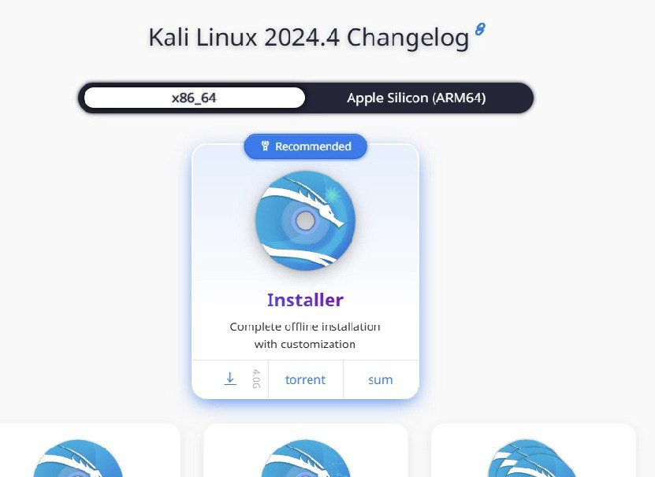
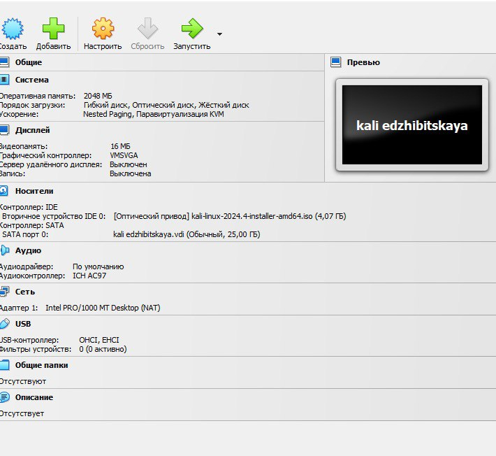
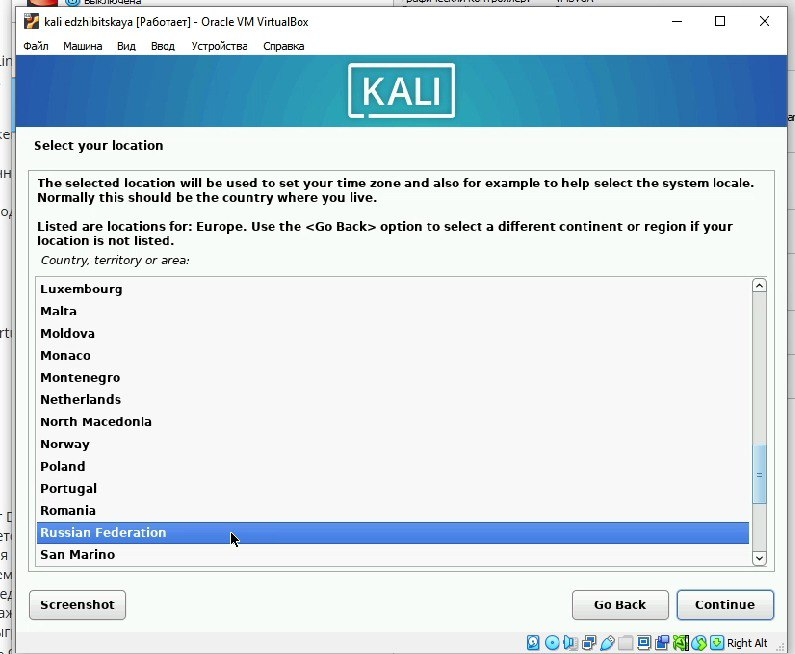
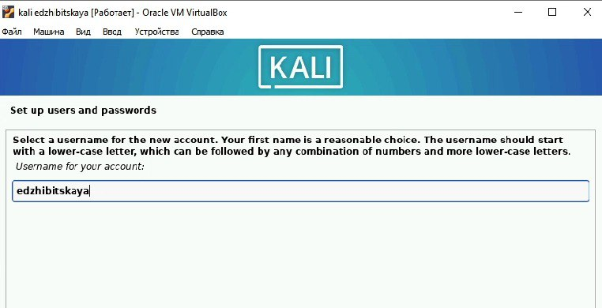

---
## Front matter
lang: ru-RU
title: Индивидуальный проект. Этап 1
subtitle: Основы информационной безопасности
author:
  - Жибицкая Е.Д.
institute:
  - Российский университет дружбы народов, Москва, Россия

## i18n babel
babel-lang: russian
babel-otherlangs: english

## Formatting pdf
toc: false
toc-title: Содержание
slide_level: 2
aspectratio: 169
section-titles: true
theme: metropolis
header-includes:
 - \metroset{progressbar=frametitle,sectionpage=progressbar,numbering=fraction}
---

# Цель

## Цель работы

- 
Установка и настройка ОС Kali linux на виртуальную машину.

# Ход работы 

## Образ диска

:::::::::::::: {.columns align=center}
::: {.column width="50%"}

:::
::: {.column width="40%"}

Заранее установим образ диска с официального сайта https://www.kali.org/
:::
::::::::::::::

## Создание машины

:::::::::::::: {.columns align=center}
::: {.column width="50%"}

:::

:::
::::::::::::::

## Установка

:::::::::::::: {.columns align=center}
::: {.column width="50%"}

{#fig:003 width=70%}

:::
::: {.column width="50%"}

:::
::::::::::::::

## Запуск

:::::::::::::: {.columns align=center}
::: {.column width="50%"}

:::
::::::::::::::

# Выводы

## Вывод

- В ходе работы были приобретены навыки по созданию виртуальной машины, установлена и налажена ОС Kali.

