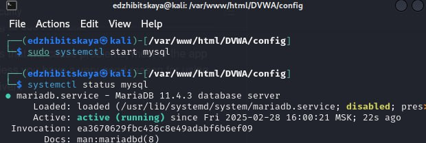
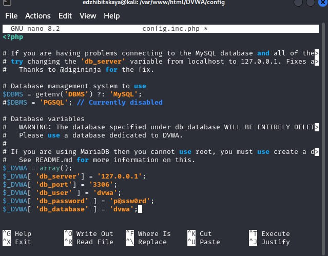
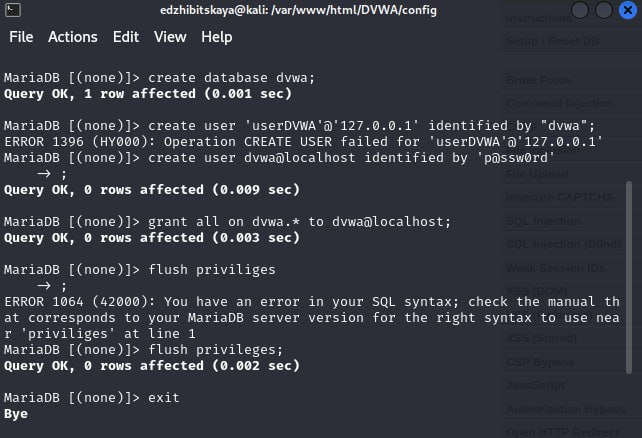
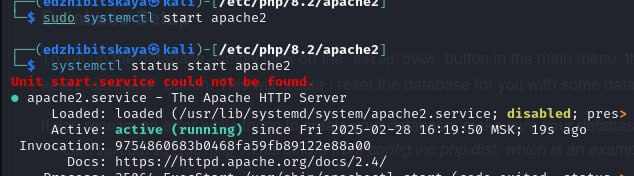
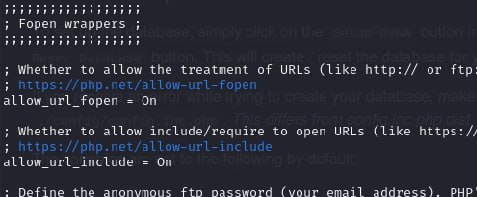
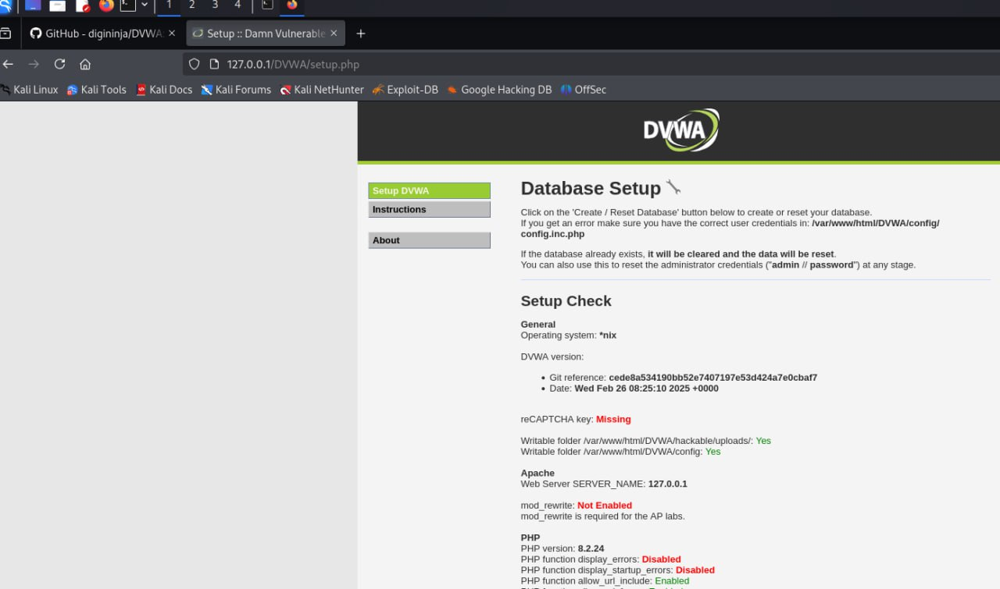
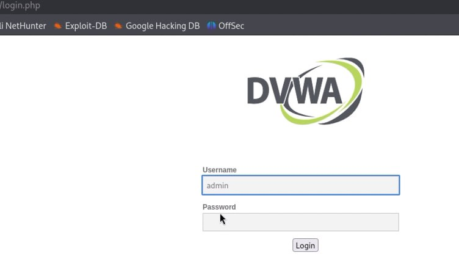
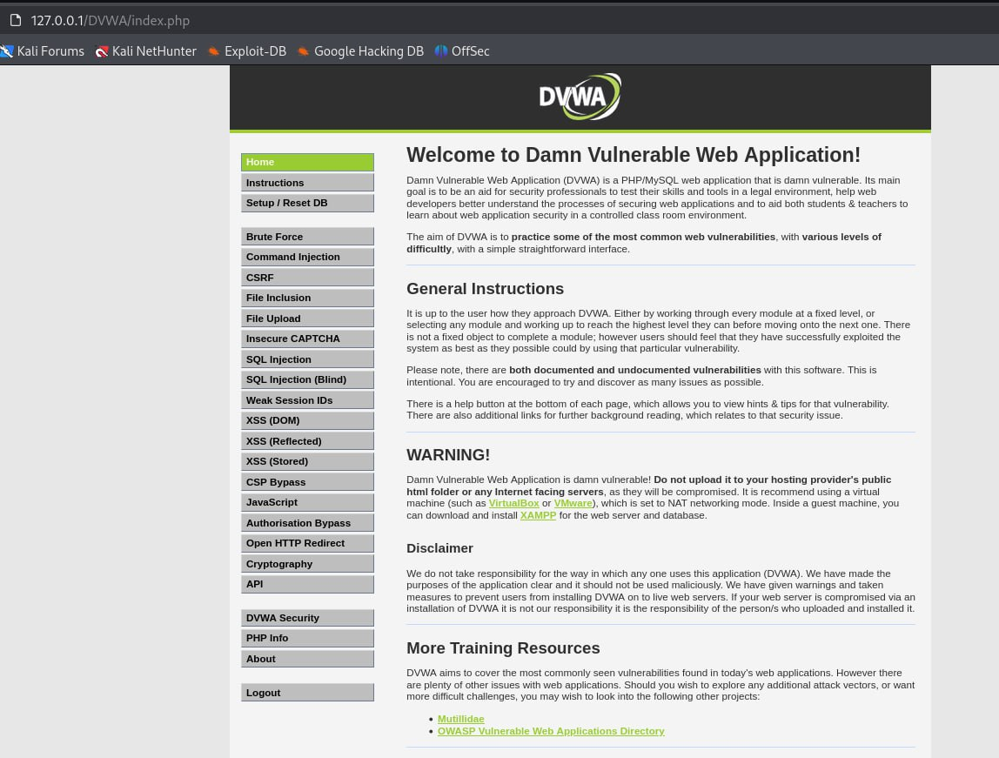

---
## Front matter
lang: ru-RU
title: Индивидуальный проект. Этап 2
subtitle: Основы информационной безопасности
author:
  - Жибицкая Е.Д.
institute:
  - Российский университет дружбы народов, Москва, Россия

## i18n babel
babel-lang: russian
babel-otherlangs: english

## Formatting pdf
toc: false
toc-title: Содержание
slide_level: 2
aspectratio: 169
section-titles: true
theme: metropolis
header-includes:
 - \metroset{progressbar=frametitle,sectionpage=progressbar,numbering=fraction}
---

# Цель

## Цель работы

- Работа с ОС Kali Linux, установка на нее и подготовка к работе DVWA 

# Ход работы 

## Клонирование репозитория

:::::::::::::: {.columns align=center}
::: {.column width="50%"}

:::
::: {.column width="40%"}

Переходим по ссылке  https://github.com/digininja/DVWA в нужный репозиторий, открываем терминал и скачиваем его. Затем перемещаем в каталог /var/www/html. Также повышаем права до максимального уровня

:::
::::::::::::::

## Настройка mysql

:::::::::::::: {.columns align=center}
::: {.column width="50%"}

:::
::: {.column width="50%"}

:::
::::::::::::::

## MariaDB
:::::::::::::: {.columns align=center}
::: {.column width="50%"}

MariaDB [(none)]> create database dvwa;

MariaDB [(none)]> create user dvwa@localhost identified by 'p@ssw0rd';

MariaDB [(none)]> grant all on dvwa.* to dvwa@localhost;

MariaDB [(none)]> flush privileges;
:::
::: {.column width="50%"}

:::
::::::::::::::

## Apache2
 
:::::::::::::: {.columns align=center}
::: {.column width="50%"}

:::
::: {.column width="40%"}

:::
::::::::::::::

## Хост

:::::::::::::: {.columns align=center}
::: {.column width="50%"}

:::
::: {.column width="50%"}

:::
::::::::::::::

## Установка завершена

:::::::::::::: {.columns align=center}
::: {.column width="50%"}

:::

::::::::::::::

# Выводы

## Вывод

- В ходе работы была установлена DVWA в гостевую систему Kali Linux, создана ДБ и произведена настройка

