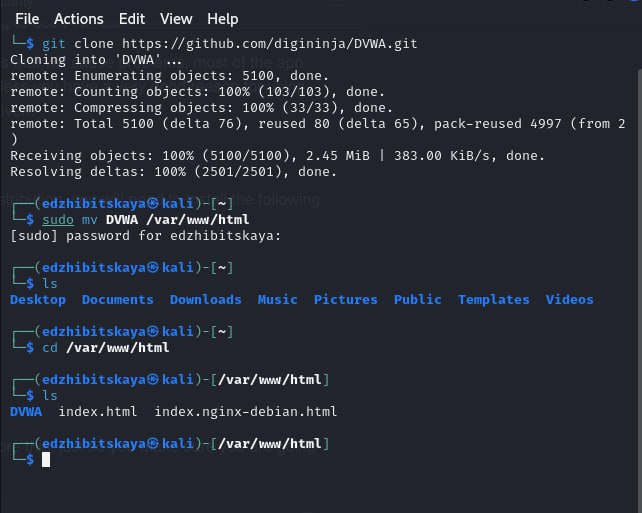
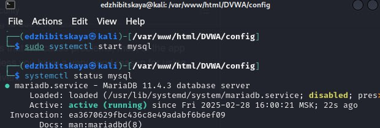
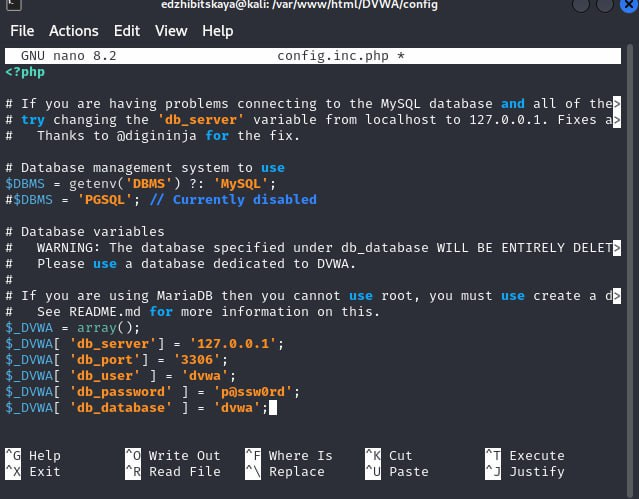
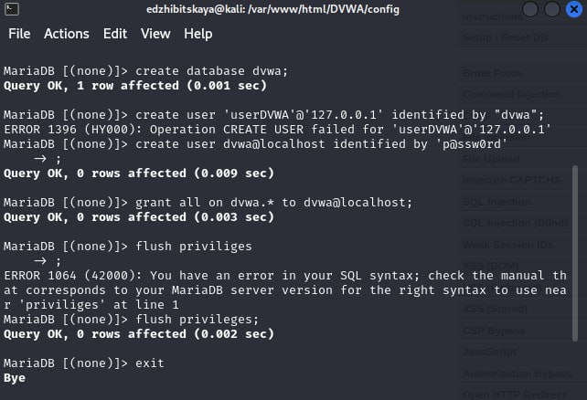
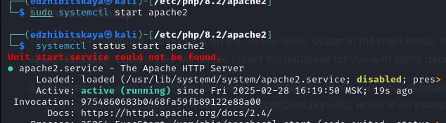
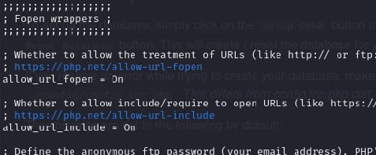
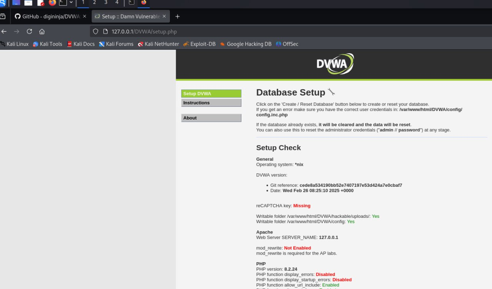
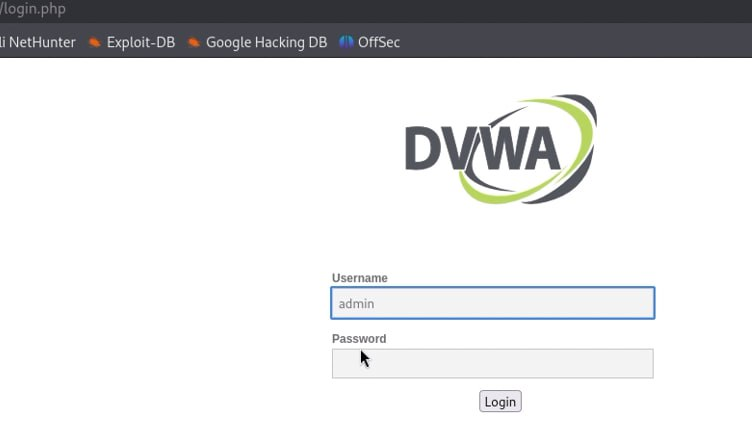
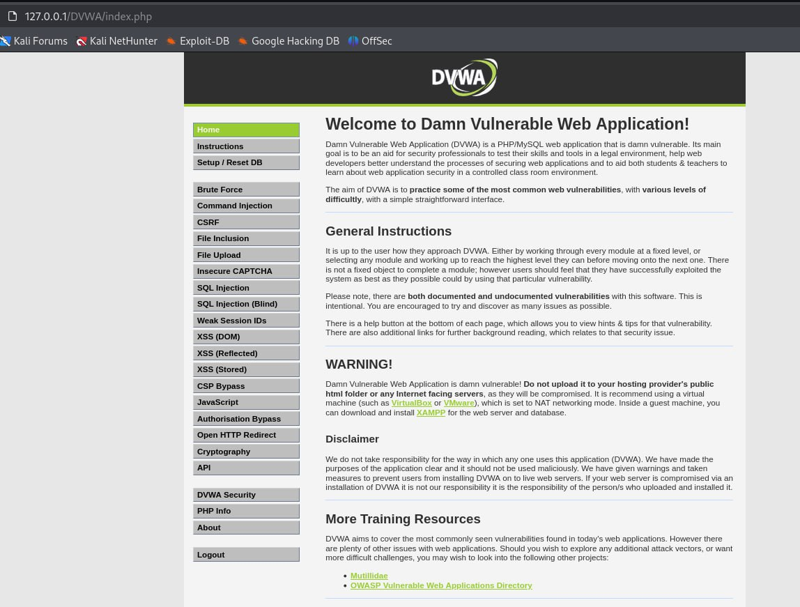

---
## Front matter
title: "Индивидуальный проект. Этап 2"
subtitle: "Дисциплина: Основы информационной безопасности"
author: "Жибицкая Евгения Дмитриевна"

## Generic otions
lang: ru-RU
toc-title: "Содержание"

## Bibliography
bibliography: bib/cite.bib
csl: pandoc/csl/gost-r-7-0-5-2008-numeric.csl

## Pdf output format
toc: true # Table of contents
toc-depth: 2
lof: true # List of figures
lot: true # List of tables
fontsize: 12pt
linestretch: 1.5
papersize: a4
documentclass: scrreprt
## I18n polyglossia
polyglossia-lang:
  name: russian
  options:
	- spelling=modern
	- babelshorthands=true
polyglossia-otherlangs:
  name: english
## I18n babel
babel-lang: russian
babel-otherlangs: english
## Fonts
mainfont: IBM Plex Serif
romanfont: IBM Plex Serif
sansfont: IBM Plex Sans
monofont: IBM Plex Mono
mathfont: STIX Two Math
mainfontoptions: Ligatures=Common,Ligatures=TeX,Scale=0.94
romanfontoptions: Ligatures=Common,Ligatures=TeX,Scale=0.94
sansfontoptions: Ligatures=Common,Ligatures=TeX,Scale=MatchLowercase,Scale=0.94
monofontoptions: Scale=MatchLowercase,Scale=0.94,FakeStretch=0.9
mathfontoptions:
## Biblatex
biblatex: true
biblio-style: "gost-numeric"
biblatexoptions:
  - parentracker=true
  - backend=biber
  - hyperref=auto
  - language=auto
  - autolang=other*
  - citestyle=gost-numeric
## Pandoc-crossref LaTeX customization
figureTitle: "Рис."
tableTitle: "Таблица"
listingTitle: "Листинг"
lofTitle: "Список иллюстраций"
lotTitle: "Список таблиц"
lolTitle: "Листинги"
## Misc options
indent: true
header-includes:
  - \usepackage{indentfirst}
  - \usepackage{float} # keep figures where there are in the text
  - \floatplacement{figure}{H} # keep figures where there are in the text
---

# Цель работы

Работа с ОС Kali Linux, установка на нее и подготовка к работе DVWA.

# Выполнение  работы

Переходим по ссылке  https://github.com/digininja/DVWA в нужный репозиторий, открываем терминал и скачиваем его. Затем перемещаем в каталог /var/www/html. Также повышаем права до максимального уровня(рис. [-@fig:001]).

{#fig:001 width=70%}

Далее переходим к настройке mysql. Запускаем службу, проверям, что она активирована и открываем файл config.inc.php(рис. [-@fig:002]).

{#fig:002 width=70%}

Открываем файл и редактируем содержимое согласно иструкции по установке(рис. [-@fig:003]).

$_DVWA[ 'db_server'] = '127.0.0.1';
$_DVWA[ 'db_port'] = '3306';
$_DVWA[ 'db_user' ] = 'dvwa';
$_DVWA[ 'db_password' ] = 'p@ssw0rd';
$_DVWA[ 'db_database' ] = 'dvwa';

{#fig:003 width=70%}:

Далее прописываем следующие команды для настройки MAriaDB(база данных по умолчанию на Kali)(рис. [-@fig:004]).

MariaDB [(none)]> create database dvwa;
Query OK, 1 row affected (0.00 sec)

MariaDB [(none)]> create user dvwa@localhost identified by 'p@ssw0rd';
Query OK, 0 rows affected (0.01 sec)

MariaDB [(none)]> grant all on dvwa.* to dvwa@localhost;
Query OK, 0 rows affected (0.01 sec)

MariaDB [(none)]> flush privileges;
Query OK, 0 rows affected (0.00 sec)

{#fig:004 width=70%}

Запускаем также службу apache2, проверям ее работу, а также редактируем файл php.ini(рис. [-@fig:005]) и (рис. [-@fig:006]).

{#fig:005 width=70%}

{#fig:006 width=70%}

Далее переходим по адресу 127.0.0.1/DVWA/setup.php(рис. [-@fig:007]), прокручиваем вниз и нажимаем на кнопку "create and reset database", вводим логи и пароль(рис. [-@fig:008]) и, наконец, попадаем на начальную страницу - установка завершена(рис. [-@fig:009])

{#fig:007 width=70%}

{#fig:008 width=70%}

{#fig:009 width=70%}

# Выводы

В ходе работы была установлена DVWA в гостевую систему Kali Linux, создана ДБ и произведена настройка.

# Список литературы{.unnumbered}

[Репозиторий DVWA и инструкция по установке ](https://github.com/digininja/DVWA )

