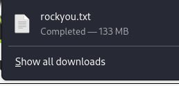
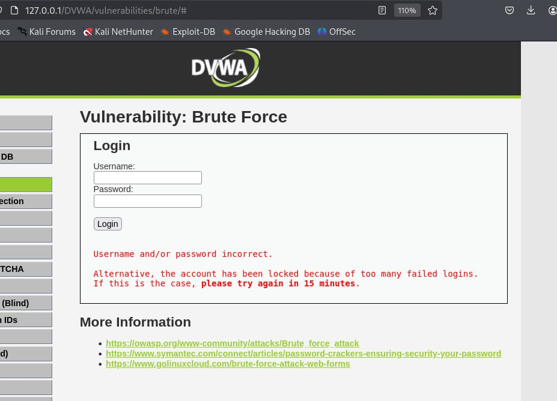
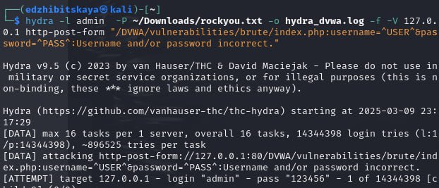
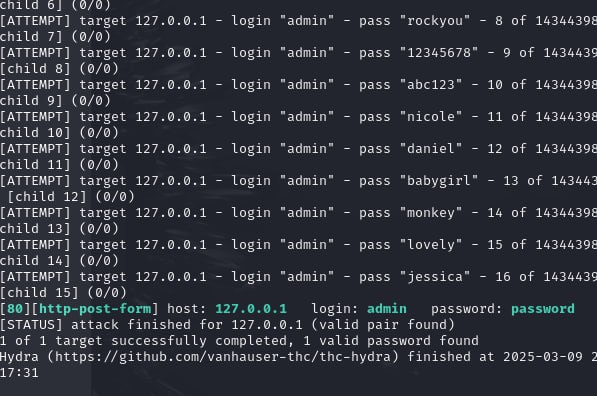
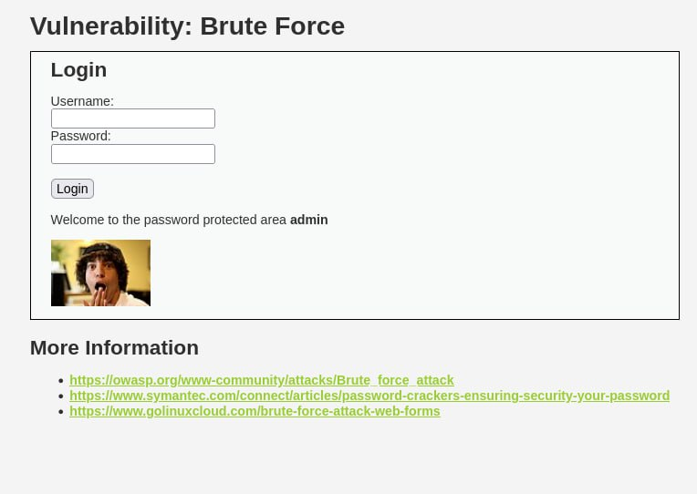

---
## Front matter
lang: ru-RU
title: Индивидуальный проект. Этап 3
subtitle: Основы информационной безопасности
author:
  - Жибицкая Е.Д.
institute:
  - Российский университет дружбы народов, Москва, Россия

## i18n babel
babel-lang: russian
babel-otherlangs: english

## Formatting pdf
toc: false
toc-title: Содержание
slide_level: 2
aspectratio: 169
section-titles: true
theme: metropolis
header-includes:
 - \metroset{progressbar=frametitle,sectionpage=progressbar,numbering=fraction}
---

# Цель

## Цель работы

- Продолжение выполнения проекта. Брутфорсинг пароля на созданном ранее DVWA, использование Hydra.

# Ход работы 

## Скачивание списка паролей

:::::::::::::: {.columns align=center}
::: {.column width="50%"}

:::
::::::::::::::

## DVWA

:::::::::::::: {.columns align=center}
::: {.column width="50%"}

Для брутфорсинга пароля используем настроенное ранее DVWA. Запустим сервер, перейдем на вкладку  Brute Force  и получим сообщение о неверно введенных даннных.

:::
::: {.column width="50%"}

:::
::::::::::::::

## Запрос к Hydra
:::::::::::::: {.columns align=center}
::: {.column width="50%"}

:::
::::::::::::::

## Подбор парлоя
 
:::::::::::::: {.columns align=center}
::: {.column width="50%"}

:::
::::::::::::::

## Проверка

:::::::::::::: {.columns align=center}
::: {.column width="50%"}

:::
::::::::::::::

# Выводы

## Вывод

-  В ходе работы были приобретены навыки по работе с hydra, была произведена попытка брутфорса паролей на DVWA.

