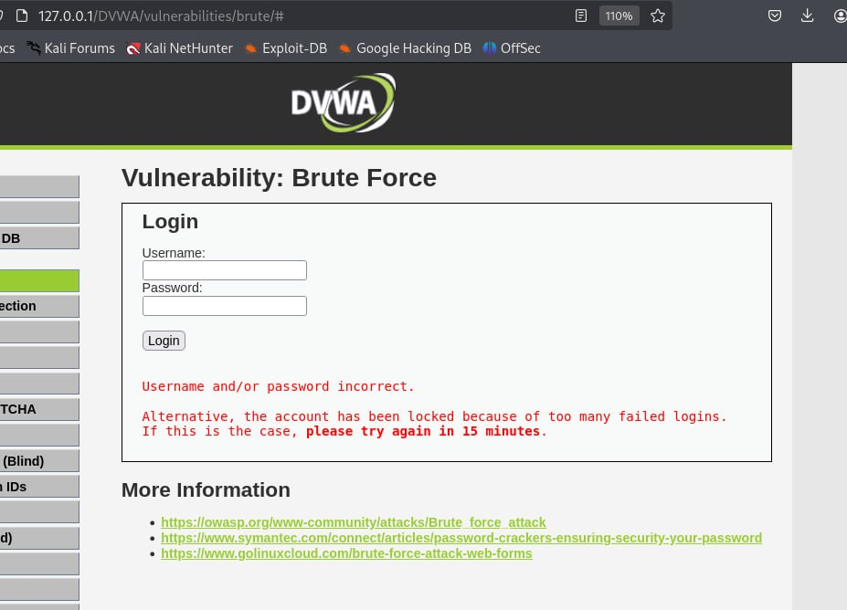
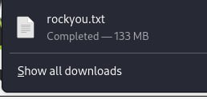
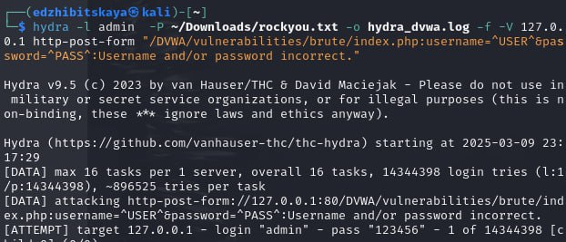
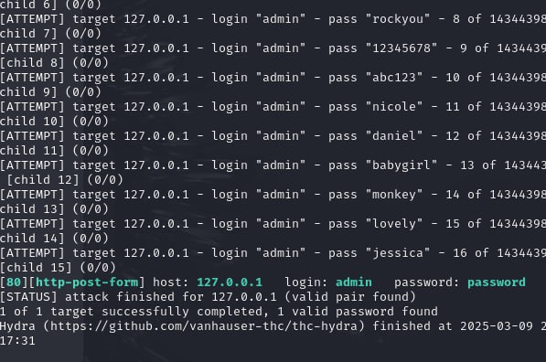
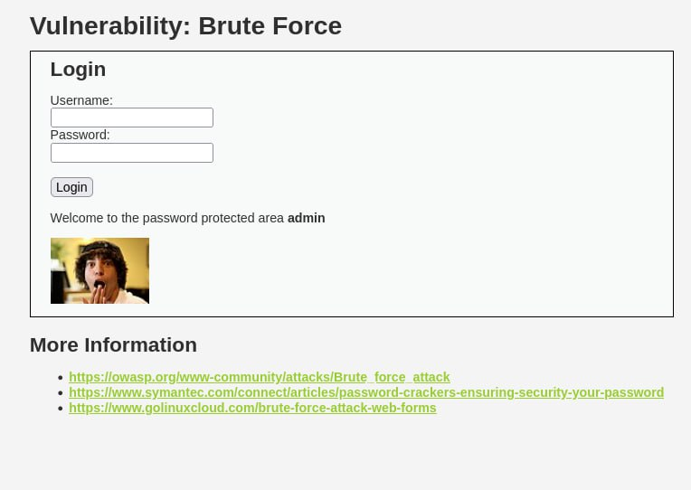

---
## Front matter
title: "Индивидуальный проект. Этап 3"
subtitle: "Дисциплина: Основы информационной безопасности"
author: "Жибицкая Евгения Дмитриевна"

## Generic otions
lang: ru-RU
toc-title: "Содержание"

## Bibliography
bibliography: bib/cite.bib
csl: pandoc/csl/gost-r-7-0-5-2008-numeric.csl

## Pdf output format
toc: true # Table of contents
toc-depth: 2
lof: true # List of figures
lot: true # List of tables
fontsize: 12pt
linestretch: 1.5
papersize: a4
documentclass: scrreprt
## I18n polyglossia
polyglossia-lang:
  name: russian
  options:
	- spelling=modern
	- babelshorthands=true
polyglossia-otherlangs:
  name: english
## I18n babel
babel-lang: russian
babel-otherlangs: english
## Fonts
mainfont: IBM Plex Serif
romanfont: IBM Plex Serif
sansfont: IBM Plex Sans
monofont: IBM Plex Mono
mathfont: STIX Two Math
mainfontoptions: Ligatures=Common,Ligatures=TeX,Scale=0.94
romanfontoptions: Ligatures=Common,Ligatures=TeX,Scale=0.94
sansfontoptions: Ligatures=Common,Ligatures=TeX,Scale=MatchLowercase,Scale=0.94
monofontoptions: Scale=MatchLowercase,Scale=0.94,FakeStretch=0.9
mathfontoptions:
## Biblatex
biblatex: true
biblio-style: "gost-numeric"
biblatexoptions:
  - parentracker=true
  - backend=biber
  - hyperref=auto
  - language=auto
  - autolang=other*
  - citestyle=gost-numeric
## Pandoc-crossref LaTeX customization
figureTitle: "Рис."
tableTitle: "Таблица"
listingTitle: "Листинг"
lofTitle: "Список иллюстраций"
lotTitle: "Список таблиц"
lolTitle: "Листинги"
## Misc options
indent: true
header-includes:
  - \usepackage{indentfirst}
  - \usepackage{float} # keep figures where there are in the text
  - \floatplacement{figure}{H} # keep figures where there are in the text
---

# Цель работы

Продолжение выполнения проекта. Брутфорсинг пароля на созданном ранее DVWA, использование Hydra.

# Выполнение работы

Для брутфорсинга пароля используем настроенное ранее DVWA. Запустим сервер, перейдем на вкладку  Brute Force  и получим сообщение о неверно введенных даннных(рис. [-@fig:001]).

{#fig:001 width=70%}

Далее скачаем список паролей, необходимый для дальнейшего пароля. Я использую rockyou.txt(рис. [-@fig:002]).

{#fig:002 width=70%}

Далее сформируем  сам запрос к hydra( на kali она предустановлена). Укажем  сначала имя пользователя, к которому подбирается запроси файл для поиска паролей.
Используем http-post-form потому, что авторизация происходит по http методом post.

После указания этого модуля идёт строка /cgi-bin/luci:username=^USER^&password=^PASS^:"...""
путь до скрипта, который обрабатывает процесс аутентификации (/cgi-bin/luci);строка, которая передаётся методом POST, в которой логин и пароль заменены на ^USER^ и ^PASS^ соответственно (username=^USER^&password=^PASS^); строка, которая присутствует на странице при неудачной аутентификации; при её отсутствии Hydra поймёт, что мы успешно вошли(рис. [-@fig:003]).

{#fig:003 width=70%}

Далее происходит перебор и поиск пароля(рис. [-@fig:004]).

{#fig:004 width=70%}

Проверка и попытка войти(рис. [-@fig:005]).

{#fig:005 width=70%}

# Выводы

В ходе работы были приобретены навыки по работе с hydra, была произведена попытка брутфорса паролей на DVWA.

# Список литературы{.unnumbered}

- [ТУИС](https://esystem.rudn.ru/mod/page/view.php?id=1220336)
- Парасрам, Ш. Kali Linux: Тестирование на проникновение и безопасность : Для профессионалов. Kali Linux / Ш. Парасрам, А. Замм, Т. Хериянто, и др. – Санкт-Петербург : Питер, 2022. – 448 сс.

