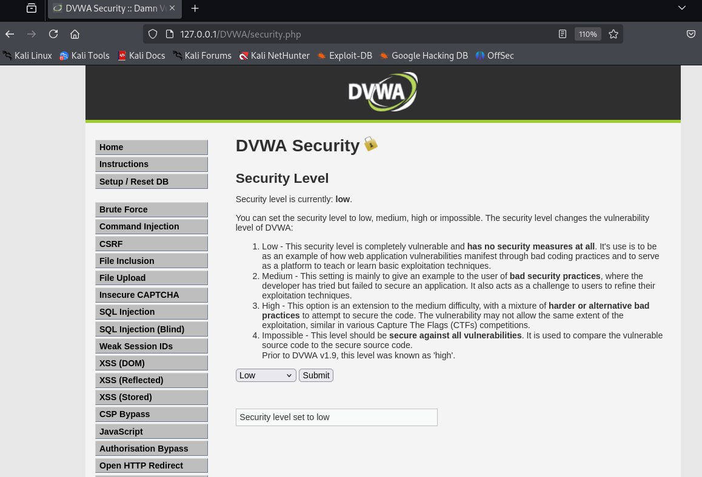
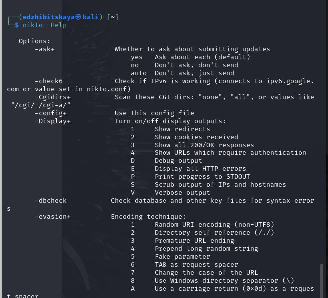
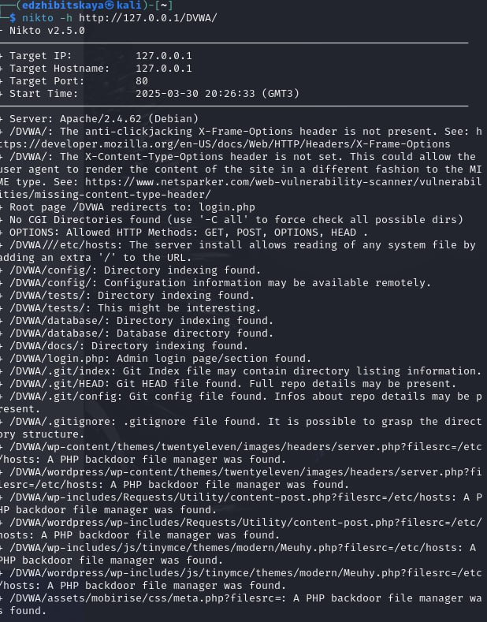
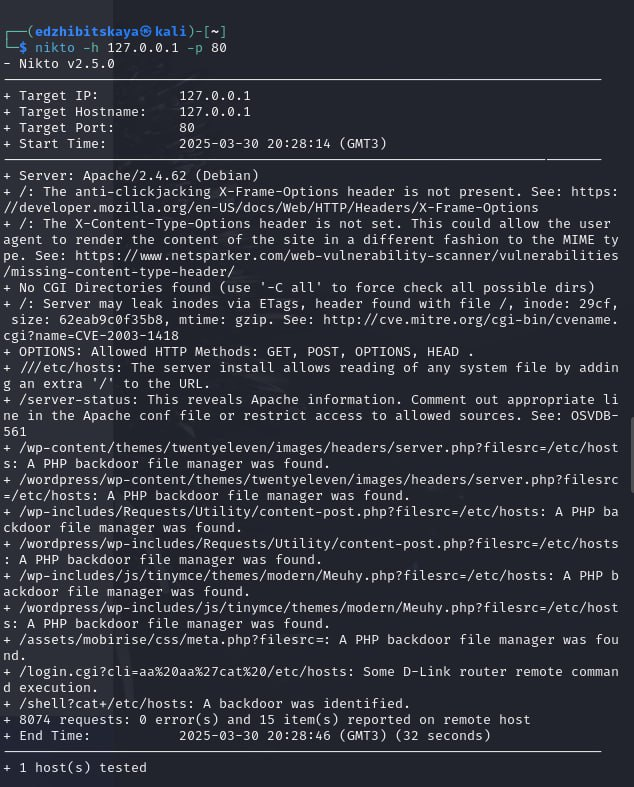

---
## Front matter
lang: ru-RU
title: Индивидуальный проект. Этап 4
subtitle: Основы информационной безопасности
author:
  - Жибицкая Е.Д.
institute:
  - Российский университет дружбы народов, Москва, Россия

## i18n babel
babel-lang: russian
babel-otherlangs: english

## Formatting pdf
toc: false
toc-title: Содержание
slide_level: 2
aspectratio: 169
section-titles: true
theme: metropolis
header-includes:
 - \metroset{progressbar=frametitle,sectionpage=progressbar,numbering=fraction}
---

# Цель

## Цель работы

 - Продолжение выполнения проекта. Освоение приложения nikto

# Ход работы 

## Подготовка к работе
:::::::::::::: {.columns align=center}
::: {.column width="50%"}

Запускаем сервер и работу DVWA - включаем mysql и apache2

:::
::: {.column width="50%"}

:::
::::::::::::::

## DVWA 
:::::::::::::: {.columns align=center}
::: {.column width="50%"}

Входим в систему, переходим в раздел Security и для удобства устанавливаем уроень low. Это не обязательно, но все  равно сделаем.
:::
::: {.column width="40%"}

:::
::::::::::::::

## Nikto

:::::::::::::: {.columns align=center}
::: {.column width="45%"}

:::
::: {.column width="50%"}

Nikto — базовый сканер безопасности веб-сервера. Он сканирует и обнаруживает уязвимости в веб-приложениях, обычно вызванные неправильной конфигурацией на самом сервере, файлами, установленными по умолчанию, и небезопасными файлами, а также устаревшими серверными приложениями.
:::
::::::::::::::

## Анализ

:::::::::::::: {.columns align=center}
::: {.column width="40%"}

:::
::::::::::::::

## Анализ
:::::::::::::: {.columns align=center}
::: {.column width="40%"}

:::
::::::::::::::

# Выводы

## Вывод

- В ходе работы мы познакомились с приложением nikto. Также был произведен анализ DVWA, получена информация о нем.

