---
## Front matter
lang: ru-RU
title: Индивидуальный проект. Этап 5
subtitle: Основы информационной безопасности
author:
  - Жибицкая Е.Д.
institute:
  - Российский университет дружбы народов, Москва, Россия

## i18n babel
babel-lang: russian
babel-otherlangs: english

## Formatting pdf
toc: false
toc-title: Содержание
slide_level: 2
aspectratio: 169
section-titles: true
theme: metropolis
header-includes:
 - \metroset{progressbar=frametitle,sectionpage=progressbar,numbering=fraction}
---

# Цель

## Цель работы

 - Завершение выполнения индивидуального проекта. Знакомство и освоение Burp Suite

# Ход работы 

## Подготовка к работе
:::::::::::::: {.columns align=center}
::: {.column width="50%"}

:::
::: {.column width="50%"}

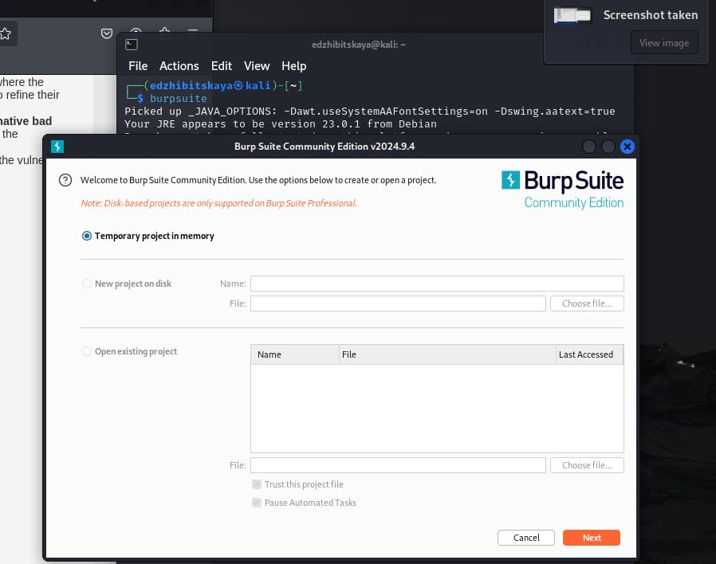
:::
::::::::::::::

## Настройка
:::::::::::::: {.columns align=center}
::: {.column width="50%"}

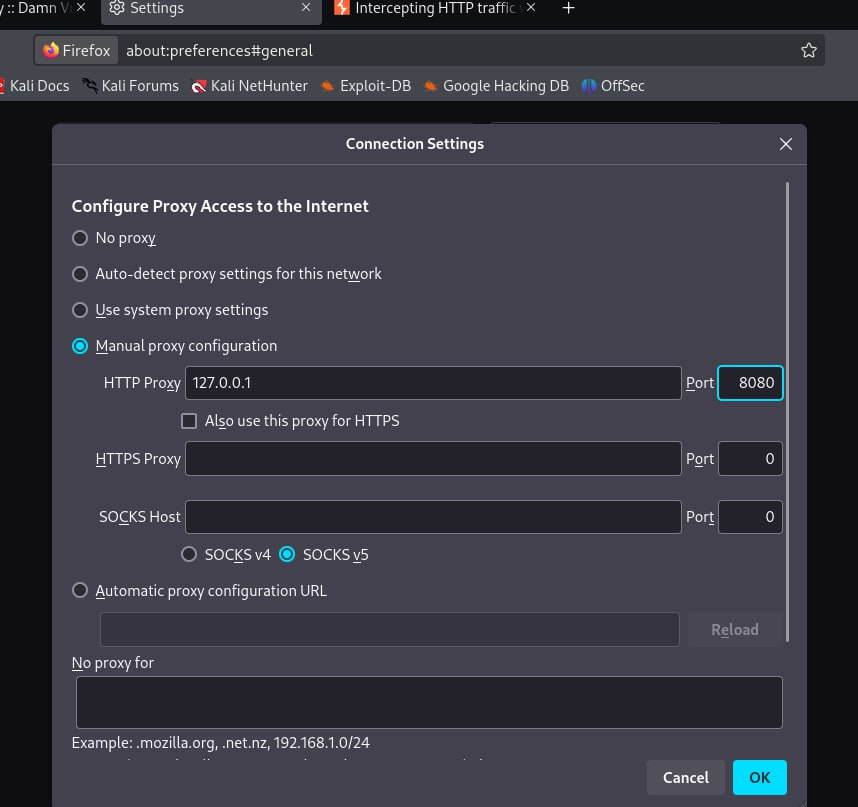
:::
::: {.column width="40%"}

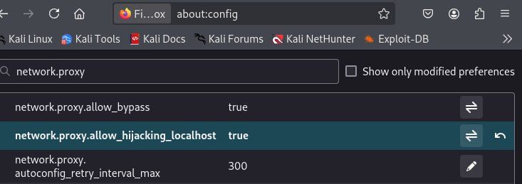
:::
::::::::::::::

## Настройка внутри приложения

:::::::::::::: {.columns align=center}
::: {.column width="45%"}

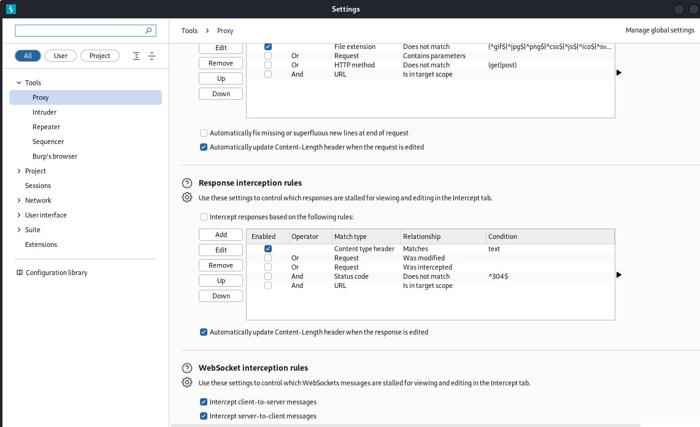

:::
::: {.column width="50%"}

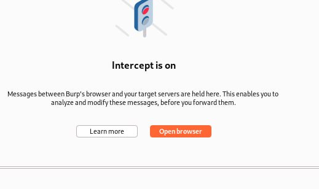
:::
::::::::::::::

## Получение запросов

:::::::::::::: {.columns align=center}
::: {.column width="45%"}

Заходим на DVWA и смотрим, что появляется во вкладке Proxy

:::
::: {.column width="50%"}

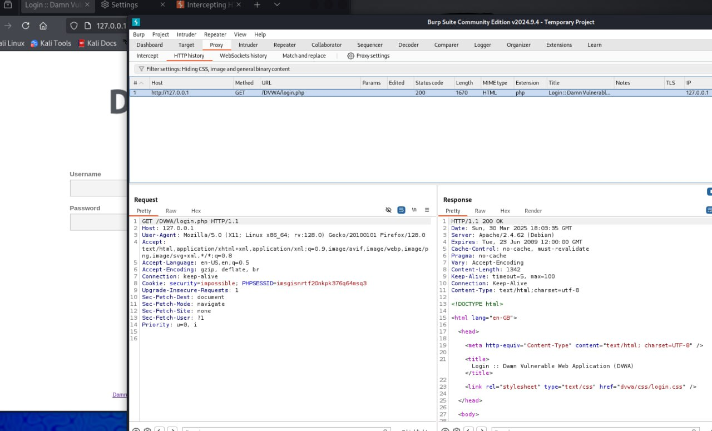
:::
::::::::::::::

## Авторизация

:::::::::::::: {.columns align=center}
::: {.column width="45%"}

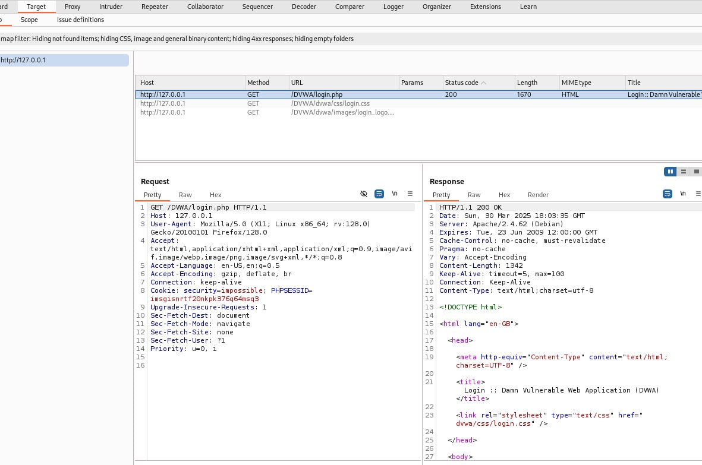
:::
::: {.column width="50%"}

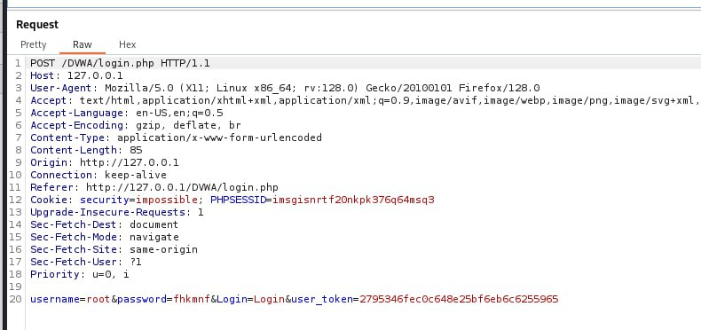
:::
::::::::::::::

## Intruder

:::::::::::::: {.columns align=center}
::: {.column width="45%"}
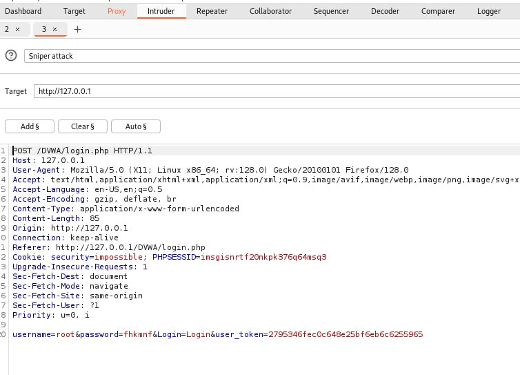
:::
::::::::::::::

## Cluster bomb attack

:::::::::::::: {.columns align=center}
::: {.column width="45%"}

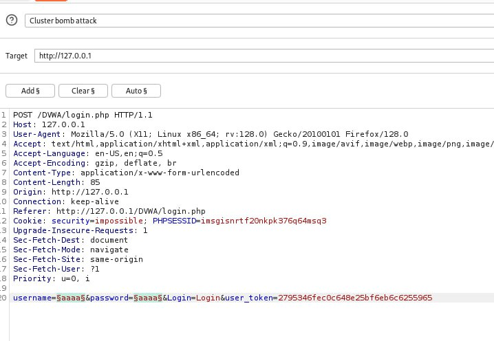
:::
::: {.column width="40%"}

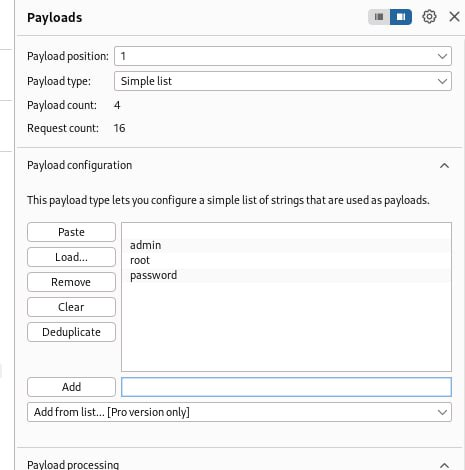

:::
::::::::::::::

## Результаты атаки

:::::::::::::: {.columns align=center}
::: {.column width="60%"}

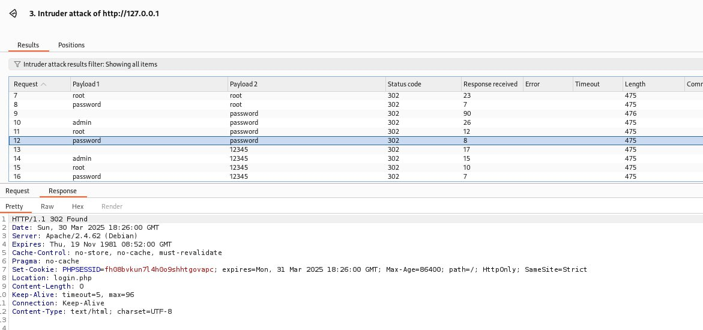
:::
::: {.column width="35%"}

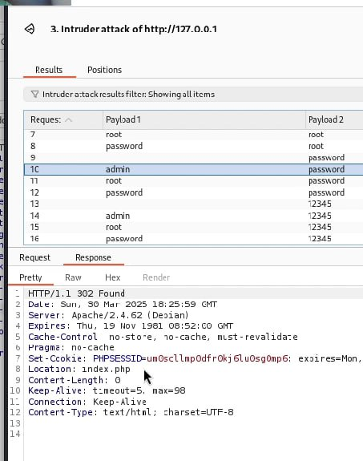

:::
::::::::::::::

## Repeater

:::::::::::::: {.columns align=center}
::: {.column width="45%"}

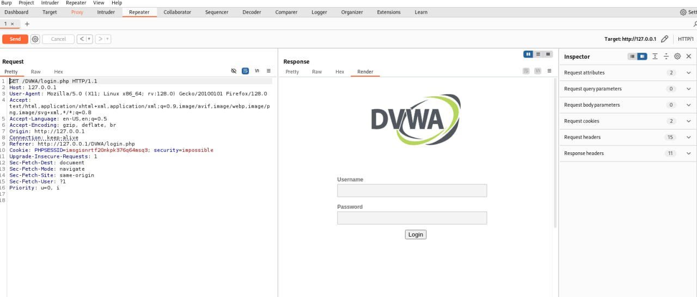
:::
::: {.column width="50%"}

Изучим также работы repeater. Перенаправим туда любой результат, посмотрим на его ответ в виде render - увидим страницу входа.

:::
::::::::::::::

# Выводы

## Вывод

- В ходе работы было произведена знакомство с Burp Suite, произведен анализ работы и  принцип атаки подбора данных для входа

